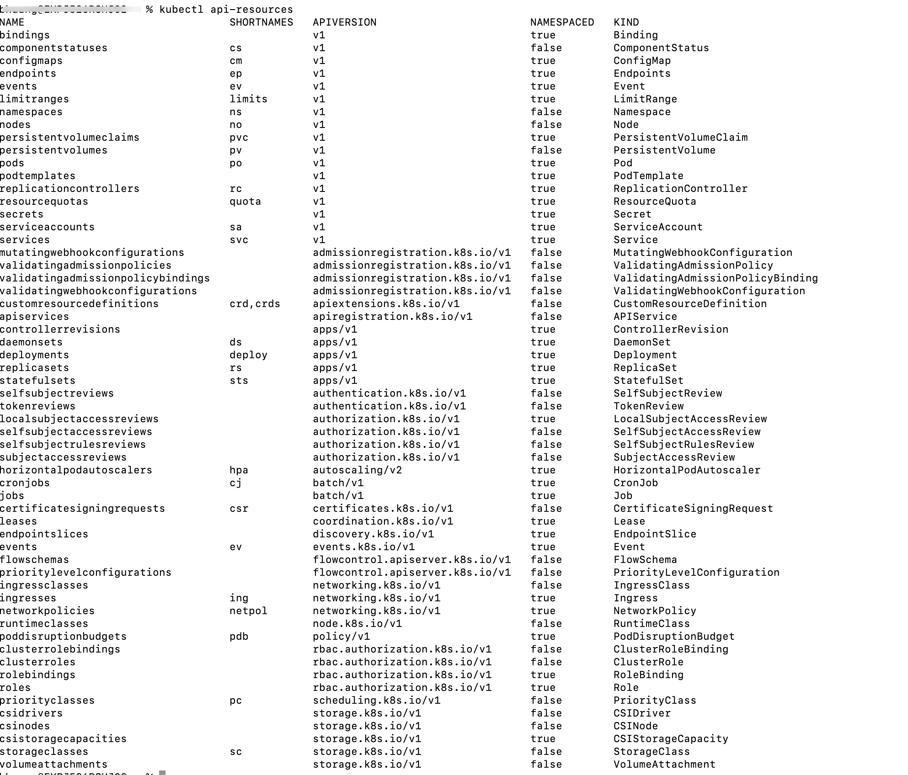
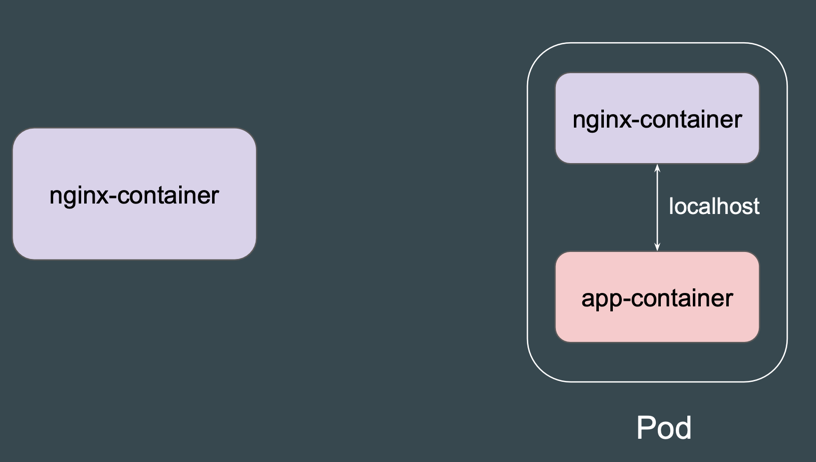

# Basic of PODS


# Multiple Ways to create K8s Objects
在 Kubernetes 中，可以使用多种方式创建资源（对象）。下面是一些常见的创建 Kubernetes 对象的方法，包括使用命令行、YAML 配置文件和其他工具。

### 1. 使用 `kubectl create`

`kubectl create` 命令允许您快速创建 Kubernetes 资源。例如，您可以创建 Deployment、Service 等。

#### 创建 Deployment
```bash
kubectl create deployment my-deployment --image=my-image --replicas=3
```

#### 创建 Service
```bash
kubectl expose deployment my-deployment --type=LoadBalancer --port=80
```

### 2. 使用 `kubectl apply`

使用 YAML 配置文件创建和管理对象的推荐方法。您可以在文件中定义所需的所有字段，然后使用 `apply` 命令进行创建。

#### 创建 YAML 文件（如 `deployment.yaml`）
```yaml
apiVersion: apps/v1
kind: Deployment
metadata:
  name: my-deployment
spec:
  replicas: 3
  selector:
    matchLabels:
      app: my-app
  template:
    metadata:
      labels:
        app: my-app
    spec:
      containers:
      - name: my-container
        image: my-image
```

#### 应用 YAML 文件
```bash
kubectl apply -f deployment.yaml
```

### 3. 使用 `kubectl run`

`kubectl run` 命令用于创建和运行单个 Pod。虽然它主要用于快速测试，但不是推荐的用于创建正式 Deployment 的方法。

```bash
kubectl run my-pod --image=my-image --restart=Always
```

### 4. 使用 Helm

Helm 是 Kubernetes 的包管理工具，允许您通过 Helm Charts 来定义、安装和管理 Kubernetes 应用程序。

#### 安装 Helm Chart
```bash
helm install my-release my-chart
```

### 5. 使用 Kustomize

Kustomize 是 Kubernetes 内置的用于定制 YAML 文件的方法。您可以创建一组基础资源并根据需要进行修改。

#### 创建 Kustomization 文件
```yaml
resources:
  - deployment.yaml
  - service.yaml
```

#### 应用 Kustomization
```bash
kubectl apply -k ./my-kustomization-directory
```

### 6. 使用 CI/CD 工具

许多持续集成和持续交付(CI/CD)工具（如 Jenkins, GitLab CI/CD, Argo CD）也可以配置为自动化 Kubernetes 对象的创建和管理。

#### 示例（使用 Jenkins Pipeline）
```groovy
pipeline {
    agent any
    stages {
        stage('Deploy to Kubernetes') {
            steps {
                script {
                    sh 'kubectl apply -f deployment.yaml'
                }
            }
        }
    }
}
```

### 7. 通过 Kubernetes API

如果您在开发自己的应用程序，可以直接调用 Kubernetes API 来创建资源。这可以通过 RESTful API 或 Kubernetes 客户端库实现。

#### 示例（使用 Python 客户端）
```python
from kubernetes import client, config

config.load_kube_config()
v1 = client.AppsV1Api()
deployment = {
    "apiVersion": "apps/v1",
    "kind": "Deployment",
    "metadata": {"name": "my-deployment"},
    "spec": {
        "replicas": 3,
        "selector": {"matchLabels": {"app": "my-app"}},
        "template": {
            "metadata": {"labels": {"app": "my-app"}},
            "spec": {
                "containers": [{"name": "my-container", "image": "my-image"}]
            }
        }
    }
}
v1.create_namespaced_deployment(namespace="default", body=deployment)
```


# Kubernetes Resource Types

```shell
kubectl api-resources
```
Kubernetes 是一个开源的容器编排平台，提供了多种资源类型来帮助管理各种环境中的容器化应用。

1. **Pod（节点）**：
   - Pod 是 Kubernetes 中最小的可部署单元，包含一个或多个容器，存储资源，唯一的网络 IP，以及容器的运行选项。Pod 是部署和管理应用的基础单位。

2. **Service（服务）**：
   - 服务是一种抽象，定义了一组选定的 Pod 以及访问它们的策略。Kubernetes 服务允许集群内和集群外的组件之间进行通信。

3. **Deployment（部署）**：
   - Deployment 用于声明性地更新 Pod 和 ReplicaSet。它简化了更新 Pod 以及管理所需状态的过程。

4. **ReplicaSet（副本集）**：
   - 确保在任何给定时间都有指定数量的 Pod 副本在运行。Deployment 管理 ReplicaSet。

5. **StatefulSet（有状态集合）**：
   - 专为需要一个或多个稳定的、唯一的网络标识符或稳定的、持久的存储的应用而设计。

6. **DaemonSet（守护进程集）**：
   - 确保所有（或某些）节点运行一个 Pod 的副本。用于部署集群应用和特定系统守护进程。

7. **Job（任务）**：
   - 管理 Pod 的创建，确保它们能成功完成。用于批处理和并行处理任务。

8. **CronJob（定时任务）**：
   - 管理基于时间的任务调度，类似于 Unix/Linux 的 cron。

9. **PersistentVolume（持久卷，PV）**：
   - 集群中已由管理员预置或通过存储类动态预置的存储块。

10. **PersistentVolumeClaim（持久卷申请，PVC）**：
    - 用户对存储的请求。根据请求的存储大小自动绑定到一个可用的 PV。

11. **ConfigMap（配置映射）**：
    - 允许将配置数据与镜像内容分离，以保持容器化应用的可移植性。

12. **Secret（密钥）**：
    - 用于存储和管理敏感信息，如密码、OAuth 令牌和 SSH 密钥。

13. **Namespace（命名空间）**：
    - 在单个 Kubernetes 集群内提供资源隔离的机制。

14. **Ingress（入口）**：
    - 管理对集群内服务的外部访问，通常是 HTTP，可以提供负载均衡、SSL 终止和基于名称的虚拟主机。

15. **NetworkPolicy（网络策略）**：
    - 控制 Pod 与网络端点之间的通信。


# Basic Structure of Manifest File
在 Kubernetes 中，Manifest File（清单文件）是以 YAML 或 JSON 格式定义的资源配置文件，用于描述 Kubernetes 资源。通过清单文件，用户可以指定资源的期望状态，然后将文件提交给 Kubernetes API Server，系统会依照清单文件的定义去创建、更新或管理这些资源。

在使用 Kubernetes 时，`kubectl` 是一个非常重要的命令行工具，帮助用户与 Kubernetes API 进行交互。而不同的子命令或选项提供了不同的功能和行为。

---

## 1. `kubectl explain`

`kubectl explain` 是 Kubernetes 提供的一个学习和查询工具，用于显示指定资源及其字段的文档解释。它可以帮助开发者和运维人员快速了解某种资源的用途和配置字段的作用。

### 基本语法
```bash
kubectl explain <资源类型> [子字段]
```

### 常见使用方式

#### **1. 查看资源类型的整体结构**
```bash
kubectl explain pod
```
返回：
- 资源类型的简要描述。
- `KIND` 和 `VERSION` 信息。
- 资源的 API 版本。

输出示例：
```plaintext
KIND: Pod
VERSION: v1

DESCRIPTION:
     Pod is a collection of containers that can run on a host...
FIELDS:
   apiVersion   <string>
   kind         <string>
   metadata     <Object>
   spec         <Object>
   status       <Object>
```

#### **2. 查看资源的特定字段**
指定需要查看的字段，可以一步步深入探索字段的说明。例如：
- 查看 `Pod.spec` 的详细说明：
  ```bash
  kubectl explain pod.spec
  ```
  输出：
  ```plaintext
  KIND:     Pod
  VERSION:  v1

  FIELD:    spec <Object>
  DESCRIPTION:
       Spec is the desired behavior of a pod.
       ...
  ```

- 查看 `Pod.spec.containers` 的详细说明：
  ```bash
  kubectl explain pod.spec.containers
  ```
  此命令可以帮助你清楚地了解容器字段的配置规则以及其作用。

#### **3. 递归查看所有子字段**
递归输出整个字段结构及其所有说明，使用 `--recursive` 选项：
```bash
kubectl explain pod.spec --recursive
```

### 使用场景
1. 初学 Kubernetes 时，帮助理解资源的配置字段。
2. 不记得某字段含义时，快速查询。
3. 编写清单文件（YAML 或 JSON）时，作为参考文档。

---

## 2. `kubectl run --dry-run`

`kubectl run` 是 Kubernetes 中用于快速创建临时 Pod 的命令。添加 `--dry-run` 参数时，它不会实际执行 Pod 创建操作，而是根据用户指定的参数生成资源定义，并返回它的 YAML 或 JSON。

> 注意：随着 Kubernetes 版本更新，`kubectl run` 的使用场景有所变化，现在主要用于创建单 Pod。如果要管理复杂资源，推荐使用 `kubectl create` 或清单文件。

### 基本语法
```bash
kubectl run NAME [--image=image] [--dry-run=<value>] [其他选项]
```

其中，`--dry-run` 参数有三个值：
- **`client`**：只在本地验证命令定义的资源配置，不与 Kubernetes API Server 通信。
- **`server`**：将命令发送到 API Server 验证，但不会创建资源。
- **`none`**（在旧版本中或不指定时的行为）：实际创建资源。

### 常见使用方式

#### **1. 生成 Pod 配置文件**
以下命令会基于 `nginx` 镜像生成一个名为 `nginx-pod` 的 Pod 配置，并以 YAML 格式输出，但不会真正创建 Pod：
```bash
kubectl run nginx-pod --image=nginx --dry-run=client -o yaml
```
输出示例：
```yaml
apiVersion: v1
kind: Pod
metadata:
  creationTimestamp: null
  labels:
    run: nginx-pod
  name: nginx-pod
spec:
  containers:
  - image: nginx
    name: nginx-pod
    resources: {}
  dnsPolicy: ClusterFirst
  restartPolicy: Always
status: {}
```

#### **2. 验证资源是否可以在集群中创建**
如果想验证命令并且与 Kubernetes 集群的 API Server 通信，但不实际创建资源，可以使用 `--dry-run=server`：
```bash
kubectl run nginx-pod --image=nginx --dry-run=server
```

输出显示：
```plaintext
Pod/nginx-pod created (dry run)
```

---

### 使用场景

1. **调试和配置文件生成**
   - 使用 `--dry-run=client` 可以快速生成资源的清单文件（YAML 或 JSON），然后编辑或保存为 `.yaml` 文件以便后续使用。

2. **验证当前 API Server 的状态**
   - 使用 `--dry-run=server`，可以确保资源是否能够成功创建。比如：检查命名冲突、验证 API Server 的健康状态等。

3. **避免误操作**
   - 在实际执行某些生产操作之前，先通过 `--dry-run` 检查命令是否正确配置。

---

### `kubectl explain` 和 `kubectl run --dry-run` 的区别

| 特性                        | `kubectl explain`                                | `kubectl run --dry-run`                          |
|-----------------------------|--------------------------------------------------|-------------------------------------------------|
| **作用**                   | 显示资源类型和字段的详细说明                     | 模拟资源创建，生成配置文件                      |
| **输出**                   | 资源字段解释说明                                 | 生成的资源清单（通常是 YAML 或 JSON）           |
| **目标**                   | 帮助理解资源字段，便于手动编写配置文件           | 自动快速生成或验证配置文件                      |
| **是否操作集群**            | 不操作集群，仅输出解释                           | 不实际创建资源，仅模拟或验证操作                |
| **典型使用场景**            | 学习资源文件，参考字段详细说明                   | 生成标准化的配置文件或验证资源是否可创建        |

---

总结来说：
- 如果你需要了解 Kubernetes 基础资源及其字段作用，使用 `kubectl explain`。
- 如果你想快速生成资源清单或验证命令的正确性，使用 `kubectl run --dry-run`。

# Difference Between Container and Pods


---
在 Kubernetes 中，“容器”（Container）和“Pod” 是两个核心概念，但它们的作用和结构设计是不同的。以下是两者的详细区别及关系：

---

### **1. 什么是容器 (Container)**

#### 定义：
- 容器是一种轻量级的、可移植的软件单元，用于运行应用程序。它通过容器化技术（如 Docker、CRI-O、containerd 等）将应用程序及其依赖项封装在一个独立的环境中，从而确保跨平台的一致性。
  
#### 特点：
- **隔离性**：每个容器都具有自己的独立运行环境，包括文件系统、CPU、内存、网络等资源。
- **快速启动**：相比虚拟机，容器启动速度更快，因为它们共享主机操作系统的内核。
- **镜像基础**：容器通过镜像（Image）创建，镜像是由分层文件系统组成的可预配置环境。
- **单一职责**：通常，一个容器中运行一个应用任务，例如 Nginx 容器负责 Web 服务，Redis 容器负责缓存。

---

### **2. 什么是 Pod**

#### 定义：
- Pod 是 Kubernetes 中的最小可部署单元。它是一组容器的逻辑封装，包含一个或多个容器，以及共享的网络命名空间和存储卷。
  
#### 特点：
- **共享网络：** Pod 内的所有容器共享同一个 IP 地址和端口命名空间，并通过 `localhost` 进行通信。
- **共享存储：** Pod 内的容器可以共享存储卷（Volume），以实现数据共享。
- **紧耦合：** Pod 中的多个容器彼此紧密协作，通常提供相辅相成的服务。例如，一个容器负责处理 HTTP 请求，另一个容器负责日志处理或缓存。

#### 设计原因：
Kubernetes 引入 Pod 是为了适应分布式系统的设计模式。Pod 支持“一组容器紧密协作并作为一个逻辑单元” 的概念。

---

### **3. 区别：容器 vs Pod**

下表总结了两者的主要区别：

| **特性**                  | **容器 (Container)**                              | **Pod**                                                |
|---------------------------|--------------------------------------------------|-------------------------------------------------------|
| **定义**                  | 轻量级的独立运行环境，用于运行单个应用程序实例。  | Kubernetes 中的最小部署单元，可以包含一个或多个容器。 |
| **运行模型**              | 独立运行，通用工具（如 Docker）用来启动单个容器。 | Pod 是 Kubernetes 的抽象单元，多个容器组成 Pod 并一同运行。 |
| **共享机制**              | 每个容器有自己独立的网络命名空间和存储范围。      | Pod 内的容器共享 IP 地址、端口和存储卷。              |
| **管理者**                | 通常由 Docker 或容器运行时直接管理。              | Pod 由 Kubernetes 管理（调度、监控、自愈等）。       |
| **用例**                  | 单一应用组件/服务的运行环境，例如运行一个 Nginx 实例。 | 多个容器协作，例如一个容器运行 Web 服务，另一个容器负责日志或代理缓存。 |
| **调度**                  | 容器本身不可调度，需要由更高层工具或平台管理。    | Kubernetes 直接调度 Pod，而非单独调度容器。          |

---

### **4. Pod 中包含多个容器的场景**

一个 Pod 通常只包含一个容器，但在一些场景下，会包含多个容器。Pod 内的容器通过共享网络、存储和生命周期，提供紧密协作的服务。

#### **多容器使用场景**：
1. **Sidecar 容器模式**：
   - 常见于微服务架构中，用一个主容器配合一个辅助容器。
   - 示例：一个容器运行主应用，另一个守护容器处理日志收集。
   
2. **辅助进程模式**：
   - 一个容器负责创建主应用需要的环境或资源，另一个容器运行主应用。
   - 示例：一个容器执行文件下载任务，另一个容器读取这些文件执行操作。

3. **共享存储场景**：
   - 多个容器需要共同访问同一个存储卷。
   - 示例：一个容器负责生成数据，另一个容器负责对数据进行处理。

#### **示例：Pod 中包含多个容器的 YAML**
以下是 Pod 的 YAML 配置文件，为包含两个容器的 Pod 提供示例：

```yaml
apiVersion: v1
kind: Pod
metadata:
  name: multi-container-pod
spec:
  containers:
  - name: web-container
    image: nginx
    ports:
    - containerPort: 80
  - name: sidecar-container
    image: busybox
    command: ["sh", "-c", "while true; do echo Hello from sidecar; sleep 5; done"]
```
解释：
- `web-container` 是主容器，运行 Nginx。
- `sidecar-container` 是辅助容器，负责定期输出日志。

---

### **5. 总结**

| **概念** | **容器 (Container)**                | **Pod**                                            |
|----------|-------------------------------------|--------------------------------------------------|
| **复杂性**     | 单个服务实例，适合简单场景独立运行。 | 能够组成容器组，实现更高级场景。                   |
| **关系**       | Pod 是容器的封装单位，一个 Pod 可以包含一个或多个容器。 |
| **管理工具**   | 通常由 Docker 管理和运行。      | 由 Kubernetes 管理，并被调度到指定的节点运行。       |
| **共享机制**   | 独立网络、存储。               | 共享网络和存储（同一个 Pod 内的容器）。           |
| **用例场景**   | 单一应用服务，侧重独立。        | 多容器协作场景，例如 Sidecar 模式，日志采集等。     |

Kubernetes 的设计哲学是将容器化单元（Container）进一步抽象成 Pod，为分布式系统提供更强大的管理能力。通过 Pod 的网络、存储和生命周期的统一管理，简化了复杂应用场景下的多容器协作问题，实现组件化开发和独立部署。

# Exec into a Container
在 Kubernetes 中，使用 `kubectl exec` 命令可以在已运行的 Pod 中执行命令。这个功能通常用于进行故障排除、调试或直接与运行中的容器进行交互。
---

### 基本语法

```bash
kubectl exec [OPTIONS] POD_NAME [-c CONTAINER_NAME] -- COMMAND [args...]
```

```shell
kubectl exec -h
Execute a command in a container.

Examples:
  # Get output from running the 'date' command from pod mypod, using the first container by default
  kubectl exec mypod -- date
  
  # Get output from running the 'date' command in ruby-container from pod mypod
  kubectl exec mypod -c ruby-container -- date
  
  # Switch to raw terminal mode; sends stdin to 'bash' in ruby-container from pod mypod
  # and sends stdout/stderr from 'bash' back to the client
  kubectl exec mypod -c ruby-container -i -t -- bash -il
  
  # List contents of /usr from the first container of pod mypod and sort by modification time
  # If the command you want to execute in the pod has any flags in common (e.g. -i),
  # you must use two dashes (--) to separate your command's flags/arguments
  # Also note, do not surround your command and its flags/arguments with quotes
  # unless that is how you would execute it normally (i.e., do ls -t /usr, not "ls -t /usr")
  kubectl exec mypod -i -t -- ls -t /usr
  
  # Get output from running 'date' command from the first pod of the deployment mydeployment, using the first container
by default
  kubectl exec deploy/mydeployment -- date
  
  # Get output from running 'date' command from the first pod of the service myservice, using the first container by
default
  kubectl exec svc/myservice -- date

Options:
    -c, --container='':
	Container name. If omitted, use the kubectl.kubernetes.io/default-container annotation for selecting the
	container to be attached or the first container in the pod will be chosen

    -f, --filename=[]:
	to use to exec into the resource

    --pod-running-timeout=1m0s:
	The length of time (like 5s, 2m, or 3h, higher than zero) to wait until at least one pod is running

    -q, --quiet=false:
	Only print output from the remote session

    -i, --stdin=false:
	Pass stdin to the container

    -t, --tty=false:
	Stdin is a TTY

Usage:
  kubectl exec (POD | TYPE/NAME) [-c CONTAINER] [flags] -- COMMAND [args...] [options]

Use "kubectl options" for a list of global command-line options (applies to all commands).
```
### 主要功能

- **连接到指定 Pod 的容器**：默认情况下，当你运行 `kubectl exec` 命令时，它会连接到 Pod 中的第一个容器。
- **执行命令**：你可以在该容器中执行任何命令，获取其输出及结果。

### 使用示例

#### 1. 执行命令到默认容器

如果你有一个名为 `my-pod` 的 Pod，其中包含一个容器，你可以执行命令，如 `ls`，例如：

```bash
kubectl exec my-pod -- ls
```

这条命令会列出 `my-pod` 中第一个容器的根目录下的文件和文件夹。

#### 2. 指定容器

当一个 Pod 中有多个容器时，你需要通过 `-c` 或 `--container` 选项来指定要执行命令的容器。例如，如果 `my-pod` 中有两个容器，`nginx` 和 `redis`，你想在 `redis` 容器中执行命令：

```bash
kubectl exec my-pod -c redis -- redis-cli ping
```

这条命令会在 `redis` 容器中运行 `redis-cli ping` 并返回结果。

#### 3. 交互模式

如果你需要与容器进行交互，比如想要进入容器的 shell，可以使用 `-i`（表示交互）和 `-t`（分配伪终端）选项。例如，进入一个容器的 `bash` 终端：

```bash
kubectl exec -it my-pod -- /bin/bash
```

### 注意事项

1. **容器引导类型**：确保在容器中存在可以执行的命令（如 `/bin/bash` 或 `/bin/sh`）。
2. **权限**：你需要确保有足够的权限可以执行命令。如果权限不足，可能会返回 "Error from server (Forbidden)" 等错误信息。
3. **网络与服务**：在执行命令时，保持网络连接的稳定性，以确保能与 Kubernetes API Server 通信。

### 用途

- **故障排除**：当 Pod 出现问题时，可以借助 `kubectl exec` 进入容器查看日志、进程、网络等状态。
- **调试**：执行特定命令以获取关于应用运行状态的即时反馈。
- **交互式操作**：对容器中的应用进行配置或手动操作。

### 例外情况

发送信号与 Pods 的容器交互（如使用 `kill` 或者其他信号）时，可以使用 `kubectl exec` 命令。

### 总结

`kubectl exec` 命令是 Kubernetes 管理中的一个非常实用的功能，能够让用户直接在容器内部执行命令，便于调试和故障排除。在有多个容器的 Pod 中，通过 `-c` 选项来指定目标容器。通过这个工具，用户可以更灵活地管理和调试容器化应用。

# Command and Arguments in Kubernetes
在 Kubernetes 中，**Command** 和 **Arguments** 是定义容器启动时要执行的命令和参数的关键部分。这两个概念用于确定容器的行为，特别是在需要自定义容器启动时。以下是对这两个元素的详细解释及其用法。

### 1. Command

**Command** 指的是容器启动时需要执行的主命令。它对应于 Unix/Linux 系统中的可执行文件或程序名。

#### 默认行为

- 在未指定 `command` 时，容器会根据其 **镜像** 的设置来使用默认的启动命令。这些默认命令通常在 Dockerfile 中由 `CMD` 指令定义。
  
#### 自定义 Command

- 你可以在 Pod 的 YAML 配置文件中使用 `command` 字段来覆盖镜像中定义的默认命令。例如：
  
```yaml
apiVersion: v1
kind: Pod
metadata:
  name: my-pod
spec:
  containers:
  - name: my-container
    image: busybox
    command: ["echo"]
    args: ["Hello, Kubernetes!"]
```

在这个示例中，容器将在启动时执行 `echo` 命令，而不是镜像默认的命令。

### 2. Arguments

**Arguments** 是提供给 `command` 的参数。它通常是与 `command` 一起使用的，帮助指定命令的行为。

#### 传递 Arguments

- `args` 字段用于指定传递给 `command` 的参数，允许用户灵活地控制命令执行的输出或行为。例如，上面的例子中，`args: ["Hello, Kubernetes!"]` 是传递给 `echo` 命令的参数。

### 示例

下面是一个更全面的 YAML 示例，展示了如何使用 `command` 和 `args`：

```yaml
apiVersion: v1
kind: Pod
metadata:
  name: my-pod
spec:
  containers:
  - name: my-container
    image: busybox
    command: ["sh", "-c"]  # 指定使用 sh 执行命令
    args: ["echo Hello from Kubernetes! && sleep 3600"]  # 参数为执行的具体命令
```

在这个示例中，容器将使用 `sh -c` 执行 `echo Hello from Kubernetes!` 命令，然后暂停 3600 秒。

### 3. 注意事项

- **数组 vs 字符串**：在 YAML 文件中，`command` 和 `args` 可以表示为数组（推荐）或字符串。但推荐使用数组形式，因为这能更好地处理特殊字符和空格。
  
    ```yaml
    # 数组表示法
    command: ["mycommand", "arg1", "arg2"]
    
    # 字符串表示法（不推荐）
    command: "mycommand arg1 arg2"
    ```

- **镜像中的 `CMD` 和 `ENTRYPOINT`**：在容器运行时，`command` 会覆盖镜像中的 `CMD`。如果镜像定义了 `ENTRYPOINT`，那么 `command` 将作为 `ENTRYPOINT` 的参数传递。

    ```dockerfile
    # Dockerfile 示例
    FROM busybox
    ENTRYPOINT ["echo"]
    CMD ["Hello from the Dockerfile"]
    ```

    使用上述镜像时，如果不传递 `command`，容器将输出 "Hello from the Dockerfile"。如果指定了 `command`，比如 `command: ["echo"]` 和 `args: ["Hello, Kubernetes!"]`，则输出将是 "Hello, Kubernetes!"。

- **安全和权限**：在某些情况下，容器可能没有足够的权限执行某些命令或操作。应确保容器有权限执行指定的命令，尤其是在需要特定操作的场景下，如文件操作、网络访问等。

### 4. 使用场景

1. **定制化启动脚本**：可以通过设置 `command` 和 `args` 使容器在启动时执行特定的初始化脚本或命令，而不是使用默认行为。
  
2. **调试和测试**：在开发和测试过程中，能够修改容器的启动行为，以帮助检查应用的输出或状态。

3. **替代镜像内置命令**：可以覆盖镜像默认命令以使其执行特定的任务或服务，更加灵活。

### 5. 总结

- **Command** 和 **Arguments** 允许用户灵活地定义容器的行为。
- 通过覆盖镜像的默认命令，可以更好地控制容器运行的过程。
- 建议使用数组格式，以提高安全性和避免解析错误。

通过合理地配置 `command` 和 `args`，系统管理员和开发人员可以充分利用 Kubernetes 带来的灵活性，从而实现高效的应用部署和管理。

# EXPOSE (Build once, use anywhere)
`EXPOSE` 指令是 Dockerfile 中的一个重要部分，用于告知 Docker 容器在运行时监听指定的网络端口。

### 1. 什么是 `EXPOSE` 指令？

- **目的**：`EXPOSE` 指令告诉 Docker 和使用该 Docker 镜像的用户，容器在运行时监听哪些网络端口。
- **文档功能**：它的作用主要是作为文档，指示构建镜像的人和运行容器的人有关哪些端口是计划公开的。请注意，`EXPOSE` 本身并不会实际发布端口。
- **语法**：`EXPOSE` 指令的语法如下：
  ```
  EXPOSE <port> [<port>/<protocol>...]
  ```

#### 示例：

```dockerfile
FROM nginx
EXPOSE 80
EXPOSE 443/tcp
```

在这个示例中：
- 端口 80 用于 HTTP 流量。
- 端口 443 明确指定使用 TCP 协议用于 HTTPS 流量。

### 2. `EXPOSE` 是如何工作的？

1. **内部通信**：`EXPOSE` 指令主要用于记录应用程序在容器内监听的网络端口。这可以帮助其他开发者和用户了解如何与容器化应用程序进行交互。

2. **非公开端口**：必须强调的是，`EXPOSE` 并不会使端口对外部可用。为了让端口可以外部访问，您需要在运行容器时使用 `-p` 或 `--publish` 标志。

#### 发布端口示例：

当您运行一个容器并希望使其在 Docker 主机外部可访问时，可以执行如下命令：

```bash
docker run -d -p 8080:80 my-nginx-image
```

在这个命令中：
- `-p 8080:80` 将容器的 80 端口映射到主机的 8080 端口，但这与 `EXPOSE` 指令没有直接关系。

### 3. `EXPOSE` 的影响

- **与其他容器的通信**：`EXPOSE` 指令在多容器应用程序中特别有用，因为它允许在同一个 Docker 网络中的容器轻松发现它们可以通过哪些端口进行通信。

- **网络连接**：在使用 Docker 网络时，容器可以自动通过暴露的端口发现彼此，而无需将端口发布到主机上。

### 4. 使用最佳实践

1. **明确性**：使用 `EXPOSE` 明确记录您的应用程序将使用哪些端口。这为使用或审查您的 Docker 镜像的人提供了明确性。

2. **结合文档**：将 `EXPOSE` 指令与文档（如 README 文件）结合使用，说明如何运行容器和访问应用程序。

3. **使用特定协议**：在暴露端口时，如有必要请指定协议（TCP/UDP），以避免歧义。

### 5. 常见用例

- **Web 应用程序**：Web 服务器（如 Nginx、Apache）通常会暴露 HTTP 和 HTTPS 端口。

- **数据库连接**：数据库如 MySQL 或 PostgreSQL 通常会暴露其各自的端口（例如 MySQL 的 3306 端口）。

- **微服务**：在微服务架构中，每个服务可以暴露其所需的端口以便其他服务通信。

### 6. 结论

`EXPOSE` 指令在 Dockerfile 中起到了重要的作用，作为文档记录哪些端口是应用程序计划使用的。它可以增强团队成员之间的理解与协作，并促进容器之间的网络连接，但不应与实际的端口发布相混淆，后者需要在容器运行时完成。
