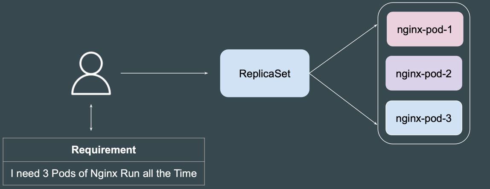

# Labels and Selectors
Kubernetes（K8s）中的 **Labels** 和 **Selectors** 是用于管理和组织资源的重要概念。它们帮助您在集群中识别、选择和操作不同的 Kubernetes 对象（如 Pod、Service、Deployment 等）。以下是对这一主题的详细介绍。

### 1. Labels（标签）

**Labels** 是一组键值对，附加在 Kubernetes 对象上，用于标识和组织对象。

#### 1.1 特性和用途

- **键值对**：Labels 是以键值对形式存在的，键（key）和值（value）均为字符串。例如：`env: production`、`app: frontend`。
- **多样性**：同一个对象可以有多个 Labels。例如，一个 Pod 可以同时具有 `app: frontend` 和 `env: production` 的标签。
- **无序性**：Labels 是无序的，虽然在定义时可以排列它们，但 Kubernetes 对其顺序不做任何假设。
- **持久性**：Labels 可以在资源的生命周期内被创建、删除和修改，修改后对与该标签相关联的对象不会影响其转移。

#### 1.2 用途

- **选择器**：通过 Labels，您可以选择特定的 Kubernetes 对象，使用 Selectors 能够高效地筛选出符合条件的对象。
- **识别**：Labels 使资源的标识、分组和分类变得更加直观。例如，可以使用标签来标识环境（开发、测试、生产）或应用程序的版本。
- **管理和监控**：工具和服务（如 Helm、Prometheus）能够使用 Labels 来管理和监控 Kubernetes 资源。

### 2. Selectors（选择器）

**Selectors** 是用于过滤和选择带有特定 Labels 的 Kubernetes 对象的条件表达式。

#### 2.1 类型

Kubernetes 支持两种类型的 Selectors：

- **Equality Selectors**：选择特定值的标签。
  
  - 语法：
    - `key = value`（等于）
    - `key != value`（不等于）

- **Set-Based Selectors**：选择标签值在特定集合中的对象。
  
  - 语法：
    - `key in (value1, value2, ...)`（属于集合）
    - `key notin (value1, value2, ...)`（不属于集合）

#### 2.2 使用示例

以下是一些使用 Selectors 的常见示例：

- **选择特定标签的 Pod**：

```bash
kubectl get pods -l app=frontend  # 选择所有 app 标签为 frontend 的 Pod
```

- **选择不等于某个标签的 Pod**：

```bash
kubectl get pods -l app!=backend  # 选择所有 app 标签不为 backend 的 Pod
```

- **使用集合选择器**：

```bash
kubectl get pods -l env in (production, staging)  # 选择所有 env 标签为 production 或 staging 的 Pod
```

### 3. 实际应用

#### 3.1 选择和操作资源

使用 Labels 和 Selectors，您可以轻松选择和操作 Kubernetes 中的资源。例如：

- **更新服务定义**：可以通过 Labels 定义 Service 并选择相关的 Pod。
  
```yaml
apiVersion: v1
kind: Service
metadata:
  name: frontend-service
spec:
  selector:
    app: frontend
  ports:
  - port: 80
    targetPort: 8080
```

- **Deployment 和 Pod 配置**：在 Deployment 中，Pod 可以使用 Labels 被管理和更新。

```yaml
apiVersion: apps/v1
kind: Deployment
metadata:
  name: frontend-deployment
spec:
  replicas: 3
  selector:
    matchLabels:
      app: frontend
  template:
    metadata:
      labels:
        app: frontend
    spec:
      containers:
      - name: frontend-container
        image: nginx
```

#### 3.2 使用 Helm 和 Operators

在 Helm Charts 和 Kubernetes Operators 中，Labels 和 Selectors 是进行资源管理和版本控制的核心组成部分。通过使用 Labels，可以将应用程序和其依赖项组织在一起，使安装和升级变得更加简便。

#### 3.3 监控和日志

许多监控工具（如 Prometheus、Grafana）的数据收集都是基于 Labels。通过对不同的 Pod、Service 或其他 Kubernetes 对象进行标记，您可以在运维过程中轻松地跟踪和分析应用程序的性能。

### 4. 最佳实践

- **清晰且一致**：定义和应用 Labels 时，请确保使用一致的命名规则，并确保它们清晰可理解，例如使用 `env`, `app`, `version` 等常见标签类别。
- **避免过度复杂化**：保持 Labels 的简单性，不必为每个细节创建标签。使用足够的标签以提供必要的信息，同时避免过度细分。
- **使用文档**：在团队内部记录标签的使用规范，以确保所有团队成员遵循相同的标准。

### 5. 总结

Kubernetes 中的 Labels 和 Selectors 是组织和管理集群中对象的强大工具。通过使用 Labels，可以灵活地标识和分组对象，而通过 Selectors，可以高效地筛选和操作这些对象。结合这两者，可以更好地管理 Kubernetes 资源，从而提升集群的可维护性和可扩展性。

# label to resources
在 Kubernetes 中，给资源（如 Pod、Deployment、Service 等）打标签可以通过 `kubectl label` 命令来实现。以下是如何使用命令给某些资源打标签的详细说明。

### 1. 使用 `kubectl label` 命令

`kubectl label` 是设置或更新 Kubernetes 资源标签的命令。其基本语法如下：

```
kubectl label <资源类型> <资源名称> <标签键>=<标签值>
```

- `<资源类型>`：要打标签的资源类型（如 pod、deployment、service 等）。
- `<资源名称>`：要打标签的资源名称。
- `<标签键>=<标签值>`：标签的键值对。

### 2. 示例

#### 2.1 给 Pod 打标签

给指定名称的 Pod 打标签：

```bash
kubectl label pod my-pod env=production
```

这将给名为 `my-pod` 的 Pod 打上 `env=production` 的标签。

#### 2.2 给 Deployment 打标签

给特定 Deployment 打标签：

```bash
kubectl label deployment my-deployment version=v1.0
```

这将给名为 `my-deployment` 的 Deployment 打上 `version=v1.0` 的标签。

#### 2.3 给 Service 打标签

给 Service 打标签的命令：

```bash
kubectl label service my-service app=myapp
```

这将给名为 `my-service` 的 Service 打上 `app=myapp` 的标签。

### 3. 更新标签

如果要更新现有的标签，可以直接使用 `kubectl label` 命令。如果它已经存在，命令将覆盖旧的值。例如：

```bash
kubectl label pod my-pod env=staging --overwrite
```

使用 `--overwrite` 标志可以强制覆盖已经存在的标签值。

### 4. 给多个资源打标签

您还可以一次给多个资源打标签，使用逗号分隔资源名称，如下所示：

```bash
kubectl label pods pod1,pod2,pod3 env=production
```

这将同时给 `pod1`、`pod2` 和 `pod3` 这三个 Pod 打上 `env=production` 的标签。

### 5. 删除标签

如果需要删除资源的某个标签，可以使用 `kubectl label` 命令并在标签键前加上 `-` 符号：

```bash
kubectl label pod my-pod env-
```

这将从 `my-pod` 中删除标签 `env`。

### 6. 查看标签

要查看资源的标签，可以使用以下命令：

```bash
kubectl get pods --show-labels
```

这将显示所有 Pods 及其对应的标签。

### 7. 总结

通过使用 `kubectl label` 命令，您可以轻松地为 Kubernetes 中的各种资源添加、更新或删除标签。这种标签的灵活管理能够帮助您在集群中有效地组织和筛选资源，从而更好地管理整体应用程序架构。记住，在使用标签时，建立一致的命名规范和使用标准会让资源管理更加顺畅。

# Introducing Kubernetes ReplicaSet

--- 
Kubernetes 中的 **ReplicaSet** 是一个重要的控制器，旨在确保指定数量的 Pod 副本在任意时刻运行。它用于维护应用程序的可用性和可扩展性，确保系统中的 Pod 数量达到预期的状态。
--- 

### 1. 什么是 ReplicaSet？

- **定义**：ReplicaSet 是 Kubernetes 中的一种资源类型，用于确保在指定时间内运行一个或多个 Pod 的副本。
- **目标**：它的主要目标是保持 Pod 的数量稳定，无论是因为 Pod 崩溃、被删除还是其他原因。ReplicaSet 确保始终有指定数量的 Pod 在运行。

### 2. ReplicaSet 的工作原理

ReplicaSet 使用标签选择器（Label Selector）来确定其管理的 Pods，并确保 Pods 的数量达到预期。具体工作流程如下：

1. **标签选择**：ReplicaSet 通过标签选择器选择一组 Pods，通常通过 `matchLabels` 来定义。
   
2. **副本管理**：ReplicaSet 会监测这些 Pods 的状态，并根据当前运行的 Pod 数量与期望的 Pod 数量进行比较。
   
3. **调整 Pod 数量**：
   - 如果实际运行的 Pod 少于期望数量，ReplicaSet 会创建新的 Pods，以达到所需的数量。
   - 如果运行的 Pod 超过期望数量，ReplicaSet 会删除多余的 Pods。

### 3. ReplicaSet 的配置示例

下面是一个 ReplicaSet 的 YAML 配置示例：

```yaml
apiVersion: apps/v1
kind: ReplicaSet
metadata:
  name: my-replicaset
spec:
  replicas: 3  # 期望运行的 Pod 副本数量
  selector:
    matchLabels:
      app: myapp  # 标签选择器，选择带有 app=myapp 标签的 Pods
  template:
    metadata:
      labels:
        app: myapp  # Pod 模板也需要包括相同的标签
    spec:
      containers:
      - name: myapp-container
        image: myapp-image:latest  # 容器镜像
        ports:
        - containerPort: 80  # 容器监听的端口
```

### 4. 创建和管理 ReplicaSet

创建 ReplicaSet 可以使用以下命令：

```bash
kubectl apply -f replica-set.yaml
```

使用以下命令查看 ReplicaSet 状态：

```bash
kubectl get replicasets
```

获取具体某个 ReplicaSet 的详细信息：

```bash
kubectl describe replicaset my-replicaset
```

### 5. 与 Deployment 的关系

在 Kubernetes 中，Deployment 是一种更高级别的 API 对象，通常用于管理 ReplicaSet。使用 Deployment，您可以更轻松地进行版本控制、回滚、扩展和更新。创建 Deployment 时，它会自动创建一个 ReplicaSet 来管理 Pods。部署的优点包括：

- **更新策略**：Deployment 支持滚动更新和回滚。
- **简化管理**：当您更新 Deployment 时，Kubernetes 会管理底层的 ReplicaSet 和 Pods。

### 6. 常见场景和使用案例

- **高可用性**：ReplicaSet 使得应用程序能够抵御部分 Pod 或节点故障，始终保持系统的高可用性。
- **负载均衡**：通过多个 Pods，ReplicaSet 能够在流量高峰时分担负载，提高应用程序的响应能力。
- **快速恢复**：当某个 Pod 失败后，ReplicaSet 会自动创建新的 Pod，从而确保应用程序的稳定性。

### 7. Best Practices

- **使用 Deployment 创建 ReplicaSet**：尽量使用 Deployment 来管理 ReplicaSet，因为它提供了更好的控制和管理能力。
- **合理设置副本数量**：根据负载和应用需求合理设置副本数量，以确保资源的高效利用。
- **使用适当的健康检查**：为 Pods 配置 liveness 和 readiness 探针，以确保服务在故障时能正确处理。
- **标签管理**：保持一致的标签使用规范，以便于之后的管理与选择。

### 8. 总结

Kubernetes 中的 ReplicaSet 是确保应用程序在任意时刻运行一定数量 Pod 的重要组件。通过标签选择器，ReplicaSet 能够动态管理 Pods，保持应用的高可用性。尽管可以单独使用 ReplicaSet，推荐使用 Deployment 来管理应用的生命周期，以便于进行版本控制和更新。通过合理的配置和管理，ReplicaSet 能够显著提高 Kubernetes 应用程序的可靠性和可扩展性。

# replicaset challenge
## Challenge 1 - Updating Container Image
When you update the pod template (e.g., change the container image) in a ReplicaSet, the existing pods are not updated.
---

在 Kubernetes 中，当您更改 ReplicaSet 中的 Pod 模板（例如，改变容器镜像）时，现有的 Pods 不会自动更新。这种行为是有意为之，目的在于确保 Pods 的稳定性和可靠性。

### 理解 ReplicaSet 的行为

1. **不可变 Pods**：由 ReplicaSet 创建的 Pods 在创建后被视为不可变。一旦 Pods 创建完成，对 pod 模板的修改不会影响已经运行的 Pods。ReplicaSet 仍然会维持指定数量的 Pods 处于运行状态，但不会像 Deployment 那样进行滚动更新。

2. **重建 Pods**：要应用更改，您通常需要删除现有 Pods，这样 ReplicaSet 才会基于更新后的模板创建新的 Pods。

### 更新 ReplicaSet 中容器镜像的步骤

如果您需要更新 ReplicaSet 中的容器镜像，可以按照以下步骤进行：

1. **更新 ReplicaSet YAML 配置**：
   修改 ReplicaSet 的 YAML 文件中的 `spec.template.spec.containers` 部分，以更改容器镜像。

   更新前的 ReplicaSet YAML 示例（镜像为 `myapp-image:v1`）：

   ```yaml
   apiVersion: apps/v1
   kind: ReplicaSet
   metadata:
     name: my-replicaset
   spec:
     replicas: 3
     selector:
       matchLabels:
         app: myapp
     template:
       metadata:
         labels:
           app: myapp
       spec:
         containers:
         - name: myapp-container
           image: myapp-image:v1  # 旧镜像
           ports:
           - containerPort: 80
   ```

   更新后的 YAML（镜像变为 `myapp-image:v2`）：

   ```yaml
   apiVersion: apps/v1
   kind: ReplicaSet
   metadata:
     name: my-replicaset
   spec:
     replicas: 3
     selector:
       matchLabels:
         app: myapp
     template:
       metadata:
         labels:
           app: myapp
       spec:
         containers:
         - name: myapp-container
           image: myapp-image:v2  # 新镜像
           ports:
           - containerPort: 80
   ```

2. **应用更新的配置**：
   使用 `kubectl apply` 命令应用更新后的 ReplicaSet。

   ```bash
   kubectl apply -f my-replicaset.yaml
   ```

3. **删除现有 Pods**：
   应用更新的配置后，您需要删除现有的 Pods，以便 ReplicaSet 能够基于更新的配置创建新的 Pods。

   ```bash
   kubectl delete pods -l app=myapp
   ```

   上面的命令会删除由 ReplicaSet 管理的 Pods，进而促使 ReplicaSet 创建带有更新镜像的新 Pods。

4. **验证更新**：
   检查 Pods 的状态，以确保创建了新的 Pods，并且这些 Pods 使用的是更新后的容器镜像。

   ```bash
   kubectl get pods -l app=myapp
   ```

### 使用 Deployment 的原因

如果您频繁需要更新应用程序版本，通常建议使用 **Deployment** 而不是 ReplicaSet。Deployment 提供了以下优势：

- **滚动更新**：自动管理更新过程，逐渐替换旧 Pods，以最小化停机时间。
- **回滚能力**：如果更新出现错误，您可以轻松回滚到先前的版本。

### 结论

虽然 ReplicaSet 有助于维护固定数量的 Pods，但它并不自动处理更新。当您在 ReplicaSet 中更新 Pod 模板时，需要手动删除现有 Pods，以允许 ReplicaSet 创建新的 Pods。如果需要更灵活的管理和更新选项，考虑使用 Deployment 将是一个更好的选择。

# Challenge 2 - No Built-In Rollback Mechanism

--- 
在 Kubernetes 中，ReplicaSet 缺乏内置的回滚机制，这意味着在进行更新（例如更新容器镜像或修改 Pod 模板）后，如果出现错误，您无法简单地回滚到之前的配置。这与 Deployment 不同，Deployment 提供了自动回滚的功能，以便于在遇到问题时恢复到先前的状态。

### ReplicaSets 无法回滚的原因

1. **设计目的**：ReplicaSet 的主要目的是确保指定数量的 Pod 始终处于运行状态，而不是用于版本管理。它负责 Pod 的创建和删除，但不处理历史版本的管理。

2. **不保存历史版本**：ReplicaSet 仅维护当前状态，因此在更新后不会生成或保存任何旧版配置。没有历史镜像或配置的自动存档。

### 如何处理更新错误

尽管 ReplicaSet 本身没有回滚机制，您仍然可以手动实施一些策略进行回滚：

#### 1. 手动干预

如果更新出现问题，您可以手动修改 ReplicaSet 的配置文件，恢复到以前的版本，然后使用 `kubectl apply` 命令重新应用修改过的配置。这需要您手动跟踪和管理版本。

例如，您可能会将之前的 YAML 文件保存为 `replica-set-v1.yaml`，在需要回滚时，您只需重新应用它：

```bash
kubectl apply -f replica-set-v1.yaml
```

#### 2. 使用历史配置版本

尽量将每个 ReplicaSet 的 YAML 配置文件保存为版本控制（例如在 Git 中），这样当需要回滚时，您可以方便地找到之前的配置版本进行恢复。

#### 3. 使用 kubectl rollout

虽然 ReplicaSet 无法本身回滚，但如果您是通过 Deployment 创建的 ReplicaSet，Deployment 提供了内置的回滚机制，可以非常简单地执行回滚：

```bash
kubectl rollout undo deployment <deployment-name>
```

此命令将自动恢复到上一个版本的配置及 Pod。

### 推荐的替代方案

考虑使用 Deployment 代替 ReplicaSet，以便利用 Deployment 提供的高级功能，例如自动回滚、版本管理、和更丰富的更新策略。这不仅简化了更新过程，还能提高应用管理的灵活性。

1. **使用 Deployment 管理应用**：

   创建一个 Deployment 并更新它时，Kubernetes 会根据指定的更新策略进行渐进式更新，如果出现问题，可以自动回滚。

   ```yaml
   apiVersion: apps/v1
   kind: Deployment
   metadata:
     name: my-deployment
   spec:
     replicas: 3
     selector:
       matchLabels:
         app: myapp
     template:
       metadata:
         labels:
           app: myapp
       spec:
         containers:
         - name: myapp-container
           image: myapp-image:v1
           ports:
           - containerPort: 80
   ```

2. **版本管理与更新策略**：

   使用 Deployment 的版本管理和滚动更新，可以有效降低更新过程中的风险。

### 结论

虽然 ReplicaSet 为维护 Pod 数量提供了有效方式，但其缺乏内置回滚机制使得管理版本和处理更新错误变得困难。通过手动管理配置和版本控制，您可以减轻这一问题的影响。然而，最好的做法是采用 Deployment 来利用其自动回滚和灵活的更新策略，以便于更加高效地管理 Kubernetes 应用程序。

# Challenge 3 - Label Collision with ReplicaSet Selectors

--- 
在在 Kubernetes 中，ReplicaSet 的选择器（selector）是其定义的关键部分，用于匹配特定标签的 Pods。当 ReplicaSet 的选择器匹配了它未创建的其他 Pods 的标签时，ReplicaSet 将错误地将这些 Pods 视为其管理的 Pods。这种情况可能导致多种意想不到的后果。

### 1. Label Collision 的问题

#### 1.1 选择器定义
ReplicaSet 的选择器用于指定哪些 Pods 被视为该 ReplicaSet 的一部分。选择器可以使用标签匹配（match labels）来指定这些 Pods。

#### 1.2 标签冲突
如果多个 ReplicaSet 使用了相同的标签，并且这些标签在 Pods 中是共享的，某个 ReplicaSet 可能会错误地包括其他 ReplicaSet 创建的 Pods。这会导致控制和管理层面的混乱。

#### 1.3 意图不明确
当 ReplicaSet 实际上不拥有某些 Pods，但选择器将其纳入管理时，ReplicaSet 的故障恢复和扩缩的决策将变得不可靠，因为系统可能试图创建或删除非其应管理的 Pods。

### 2. 可能导致的后果

- **资源竞争**：不小心管理其他应用的 Pods 可能会导致资源的争夺和调度失败。

- **意外删除**：如果 ReplicaSet 的副本数设置为特定值，Kubernetes 可能会删除那些未由 ReplicaSet 创建的 Pods，以使其管理的 Pods 数目达到指定的副本数。

- **观察和监控困难**：使用相同标签的多个 ReplicaSet 将使监控和日志记录变得更加复杂，因为您可能无法明确区分哪些 Pods 是由哪个 ReplicaSet 管理的。

### 3. 解决方案

为避免标签冲突的问题，可以采取以下措施：

#### 3.1 使用唯一的标签
确保每个 ReplicaSet 和其创建的 Pods 使用唯一的标签。通过为每个 ReplicaSet 定义专属的标签，您可以确保选择器只匹配相应的 Pods。

例如，为每个 ReplicaSet 添加服务或功能相关的标签：

```yaml
apiVersion: apps/v1
kind: ReplicaSet
metadata:
  name: web-replicaset
spec:
  replicas: 3
  selector:
    matchLabels:
      app: myapp
      role: web  # 明确指明角色
  template:
    metadata:
      labels:
        app: myapp
        role: web  # 明确指明角色
    spec:
      containers:
      - name: myapp-container
        image: myapp-image:latest
```

#### 3.2 使用 Namespace
在 Kubernetes 中使用不同的命名空间隔离不同的应用程序。为了避免标签冲突和管理混乱，可以将不同的应用和相关的 ReplicaSets 放在不同的命名空间中。

#### 3.3 最小化使用通配符选择器
避免使用过于宽泛的选择器条件（例如使用 `*` 或 `exist` ），因为这可能会扩大匹配范围，导致意外行为。

#### 3.4 定期审查和管理标签
定期审查标签和选择器的使用情况，确保它们符合当前的应用架构和需求，避免标签冗余和冲突。

### 结论

ReplicaSet 的选择器是其正常运行的关键，但不当配置会导致标签冲突，影响资源管理和 Pod 的生命周期管理。通过使用唯一的标签、合理的命名空间、避免使用通用选择器和定期审查标签，您可以有效避免标签冲突问题，从而确保 Kubernetes 集群的高效和稳定运行。

# Deployments
A Deployment is a higher-level abstraction built on top of ReplicaSets.
It not only manages ReplicaSets but also provides advanced features like rolling updates, rollbacks, and versioning.
---

---
KKubernetes 中的 Deployment 是一种用于管理应用程序的声明式方法，提供了一种更高级别的抽象，来确保运行在 Pods 中的容器的状态与用户的期望状态一致。Deployment 是 Kubernetes 中最常用的控制器之一，广泛用于处理应用程序的创建、更新和删除。

### 1. Deployment 的基本概念

#### 1.1 定义
Deployment 允许用户定义一个应用程序所需的 Pods 的数量、容器使用的镜像、更新策略等。当应用程序状态发生变化时，Deployment 会负责管理这些变化并确保所需状态被达成。

#### 1.2 主要功能
- **版本管理**：Deployment 自动管理应用程序的多个版本，使得在更新时确保不影响可用性。
- **滚动更新**：通过逐步替换 Pods 的方式，实现无停机更新。
- **回滚**：可以轻松地将应用程序恢复到先前的版本。
- **自我修复**：如果 Pods 出现故障，Deployment 会自动重新创建它们以保持所需的 Pod 副本数。

### 2. Deployment 的结构

Deployment 的 YAML 配置文件通常包含以下重要字段：

```yaml
apiVersion: apps/v1
kind: Deployment
metadata:
  name: <deployment-name>  # Deployment 的名称
spec:
  replicas: <number-of-replicas>  # Pod 的副本数
  selector:  # 选择器，用于匹配 Pod 标签
    matchLabels:
      app: <app-name>
  template:  # Pod 模板
    metadata:
      labels:
        app: <app-name>
    spec:
      containers:  # 容器定义
      - name: <container-name>
        image: <container-image>  # 容器镜像
        ports:  # 容器暴露的端口
        - containerPort: <port>
```

### 3. 如何创建和管理 Deployment

#### 3.1 创建 Deployment

1. **编写 YAML 文件**：
   创建一个包含 Deployment 定义的 YAML 文件，例如 `deployment.yaml`。
   
   ```yaml
   apiVersion: apps/v1
   kind: Deployment
   metadata:
     name: my-app-deployment
   spec:
     replicas: 3
     selector:
       matchLabels:
         app: myapp
     template:
       metadata:
         labels:
           app: myapp
       spec:
         containers:
         - name: myapp-container
           image: myapp-image:latest
           ports:
           - containerPort: 80
   ```

2. **使用 kubectl 应用配置**：
   通过以下命令创建 Deployment：
   ```bash
   kubectl apply -f deployment.yaml
   ```

#### 3.2 验证 Deployment 状态

使用以下命令查看 Deployment 的状态：
```bash
kubectl get deployments
```

可以使用 `kubectl describe deployment my-app-deployment` 命令获取更详细的信息，包括当前 Pods 的状态、更新策略等。

#### 3.3 更新 Deployment

更新 Deployment 可以简单地编辑 YAML 文件，或使用 `kubectl set image` 命令进行镜像版本更新。例如，要将镜像更新为新版本：

```bash
kubectl set image deployment/my-app-deployment myapp-container=myapp-image:v2
```

Kubernetes 将根据定义的更新策略逐步替换 Pods，以实现无缝更新。

#### 3.4 回滚 Deployment

如果更新后发现问题，可以使用以下命令回滚到之前的版本：
```bash
kubectl rollout undo deployment/my-app-deployment
```

#### 3.5 删除 Deployment

要删除 Deployment 可以使用以下命令：
```bash
kubectl delete deployment my-app-deployment
```

### 4. Deployment 的更新策略

Deployment 支持多种更新策略，默认情况下为滚动更新。更新策略有：

- **RollingUpdate**（默认）：逐步更新 Pods，新 Pods 启动后旧 Pods 会被逐步替换，并确保在任何时间都有一定数量的 Pods 可以提供服务。

- **Recreate**：在更新时先删除所有旧的 Pods，然后创建新的 Pods。这种策略会导致一定周期内没有可用的 Pods，因此在零停机时间要求非常严格的场景下不推荐使用。

可以在 Deployment 配置中指定更新策略：

```yaml
spec:
  strategy:
    type: RollingUpdate
    rollingUpdate:
      maxUnavailable: 1  # 最多不可用的 Pods 数量
      maxSurge: 1  # 最多额外的 Pods 数量
```

### 5. Deployment 的缩放

您可以随时更改 Deployment 的 `replicas` 字段，来调整 Pods 的副本数。例如，要将副本数改为 5：

```bash
kubectl scale deployment my-app-deployment --replicas=5
```

### 6. 日志和监控

在 Kubernetes 中，您可以使用以下命令查看 Pods 的日志：
```bash
kubectl logs <pod-name>
```

此外，您可以集成监控工具（如 Prometheus、Grafana）来获得更好的可观察性和监控。

### 结论

Kubernetes 中的 Deployment 提供了一种易于使用、灵活的方式来管理应用程序的生命周期。它的版本管理、滚动更新和回滚功能使得在生产环境中管理应用程序变得更加安全和高效。通过掌握 Deployment 的基本概念和操作，您可以更好地利用 Kubernetes 的能力来处理复杂的应用部署和管理任务。

# affinity

Kubernetes 中的 **亲和性（Affinity）** 是用于控制 Pod 调度到特定节点（Node）或与其他 Pod 协同调度的机制。它比简单的节点选择器（Node Selector）更灵活，允许更复杂的规则组合。

---

### **1. 亲和性的类型**
亲和性分为两种主要类型：
1. **节点亲和性（Node Affinity）**：控制 Pod 调度到哪些节点。
2. **Pod 亲和性/反亲和性（Pod Affinity/Anti-Affinity）**：控制 Pod 与其他 Pod 的协同调度（例如：将 Pod 部署在同一区域，或避免与某些 Pod 共存）。

---

### **2. 节点亲和性（Node Affinity）**
#### **核心作用**
通过节点的标签（Labels）定义 Pod 应该调度到哪些节点，支持两种规则：
- **必须满足（硬性规则）**：`requiredDuringSchedulingIgnoredDuringExecution`
- **尽量满足（软性规则）**：`preferredDuringSchedulingIgnoredDuringExecution`

#### **配置示例**
```yaml
apiVersion: v1
kind: Pod
metadata:
  name: my-pod
spec:
  affinity:
    nodeAffinity:
      # 硬性规则：必须满足
      requiredDuringSchedulingIgnoredDuringExecution:
        nodeSelectorTerms:
        - matchExpressions:
          - key: disktype      # 节点标签的 Key
            operator: In       # 操作符（In, NotIn, Exists 等）
            values:
            - ssd            # 节点标签的 Value
      # 软性规则：尽量满足（可设置权重）
      preferredDuringSchedulingIgnoredDuringExecution:
      - weight: 50            # 权重范围 1-100
        preference:
          matchExpressions:
          - key: zone
            operator: In
            values:
            - zone-a
  containers:
  - name: nginx
    image: nginx
```

#### **关键字段解析**
- **`operator`**：支持的操作符包括：
  - `In`：标签值在列表中。
  - `NotIn`：标签值不在列表中。
  - `Exists`：标签存在（无需指定 `values`）。
  - `DoesNotExist`：标签不存在。
  - `Gt`（大于）、`Lt`（小于）：用于数值比较。
- **`weight`**：仅对软性规则有效，权重越高，优先级越高（总和为 100 时，权重直接表示优先级百分比）。

---

### **3. Pod 亲和性/反亲和性（Pod Affinity/Anti-Affinity）**
#### **核心作用**
- **Pod 亲和性**：让 Pod 与其他 Pod **部署在同一拓扑域**（例如同一节点、同一可用区）。
- **Pod 反亲和性**：让 Pod **避免与其他 Pod 部署在同一拓扑域**。

#### **拓扑域（Topology Key）**
- 拓扑域由节点的标签定义（如 `topology.kubernetes.io/zone` 表示可用区）。
- 例如：若 `topologyKey: topology.kubernetes.io/zone`，则同一可用区内的节点属于同一拓扑域。

#### **配置示例**
```yaml
apiVersion: v1
kind: Pod
metadata:
  name: my-pod
spec:
  affinity:
    podAffinity:
      # 必须与带有 app=redis 的 Pod 在同一可用区
      requiredDuringSchedulingIgnoredDuringExecution:
      - labelSelector:
          matchExpressions:
          - key: app
            operator: In
            values:
            - redis
        topologyKey: topology.kubernetes.io/zone
    podAntiAffinity:
      # 尽量不与带有 app=log 的 Pod 在同一节点
      preferredDuringSchedulingIgnoredDuringExecution:
      - weight: 100
        podAffinityTerm:
          labelSelector:
            matchExpressions:
            - key: app
              operator: In
              values:
              - log
          topologyKey: kubernetes.io/hostname
  containers:
  - name: nginx
    image: nginx
```

#### **关键字段解析**
- **`labelSelector`**：匹配目标 Pod 的标签。
- **`topologyKey`**：定义拓扑域的节点标签。
- **`namespaces`**（可选）：指定目标 Pod 的命名空间，默认是当前 Pod 的命名空间。

---

### **4. 使用场景**
#### **场景1：节点亲和性**
- **硬件需求**：将需要 GPU 的 Pod 调度到带有 `gpu=true` 标签的节点。
- **区域部署**：优先将 Pod 调度到特定可用区（如 `zone: east`）。

#### **场景2：Pod 亲和性**
- **数据本地性**：将计算 Pod 与缓存 Pod（如 Redis）部署在同一可用区，减少网络延迟。
- **微服务协同**：将关联服务部署在同一拓扑域（例如同一节点）。

#### **场景3：Pod 反亲和性**
- **高可用**：确保同一服务的多个副本分布在不同的节点或可用区（避免单点故障）。
- **资源隔离**：避免资源密集型 Pod 部署在同一节点。

---

### **5. 高级配置与注意事项**
#### **规则组合**
- 可以同时使用节点亲和性和 Pod 亲和性/反亲和性。
- 硬性规则（`required...`）和软性规则（`preferred...`）可以组合使用。

#### **操作符的灵活使用**
- **`Exists` 和 `DoesNotExist`**：无需指定 `values`。
  ```yaml
  matchExpressions:
  - key: gpu
    operator: Exists  # 节点必须存在 gpu 标签（值无关）
  ```

- **数值比较**（仅限节点亲和性）：
  ```yaml
  matchExpressions:
  - key: memory
    operator: Gt
    values:
    - "16"  # 节点内存标签值大于 16
  ```

#### **性能影响**
- Pod 亲和性/反亲和性需要计算拓扑域关系，可能增加调度时间，**避免过度使用**。

---

### **6. 与 Taint/Toleration 的区别**
- **亲和性**：定义 Pod **倾向于调度到哪里**。
- **污点与容忍度**：定义节点**排斥哪些 Pod**，是反向筛选机制。
- **二者协作**：可以先用 Taint 排除不合适的节点，再用 Affinity 选择最佳节点。

---

### **7. 常见问题**
#### **问题1：Pod 无法调度**
- **原因**：硬性规则（`required...`）未满足。
- **检查**：节点标签是否正确，操作符是否匹配。

#### **问题2：软性规则未生效**
- **原因**：其他软性规则权重更高，或资源不足。
- **调试**：使用 `kubectl describe pod` 查看调度事件。

#### **问题3：反亲和性导致副本分散不足**
- **解决**：调整 `topologyKey` 的范围（如从节点级 `hostname` 改为可用区级 `zone`）。

---

### **总结**
亲和性机制通过标签匹配和拓扑域定义，实现了 Kubernetes 调度的精细化控制：
- **节点亲和性**：定向选择硬件或区域。
- **Pod 亲和性/反亲和性**：优化服务协同与高可用。
- **核心逻辑**：`operator` 决定匹配方式，`topologyKey` 决定影响范围，`weight` 控制软性优先级。

# Request & Limits
在 Kubernetes 中，Requests 和 Limits 是 Pod 中资源管理的重要概念。这两个功能允许用户为容器指定所需的计算资源（如 CPU 和内存），并帮助 Kubernetes 更好地调度和管理资源。以下是关于 Requests 和 Limits 的详细讲解。
---
### 1. 资源管理的重要性

在多租户环境（如 Kubernetes 集群）中，确保每个 Pod 拥有足够的资源以保持良好的性能，同时又不会超出共享资源的能力是至关重要的。通过设置 Requests 和 Limits，可以平衡资源的分配，从而实现有效的资源利用。

### 2. Requests

**Requests** 是为容器指定的最小计算资源的需求。它告诉调度器该容器启动时需要多少资源。这有助于调度器在节点上放置 Pods 时做出更佳的决策，以确保有足够的资源可供容器使用。

- **CPU Requests**：指定 Pods 启动和运行所需的最小 CPU 资源。单位以 CPU 的核心数描述，1 CPU 代表一个完整的 CPU 核心，部分 CPU 可以使用小数表示，如 0.5 代表 50% 的核心。
  
- **Memory Requests**：指定 Pods 启动所需的最小内存。单位可以是字节（如 "1024" 表示 1024 字节），或者可以使用更易读的单位，如 KiB（千字节）、MiB（兆字节）、GiB（千兆字节）等（例如 "512Mi"）。

### 3. Limits

**Limits** 是为容器设置的最大资源限制。它定义了容器最多可以使用的资源量。如果容器试图超出这个限制，则会被受限，可能导致其性能下降。

- **CPU Limits**：限制 Pods 的最大 CPU 使用量。容器在超过 CPU 限制时，被限制的 CPU 根本无法使用。

- **Memory Limits**：限制 Pods 的最大内存使用量。如果容器使用的内存超过该限制，它可能会被杀死，并由 Kubernetes 调度器重启（pods 中的 OOMKilled，Out Of Memory Killed）。

### 4. 示例配置

在 Pod 的 YAML 配置中，Requests 和 Limits 可以在 `resources` 字段下设置。以下是一个示例配置：

```yaml
apiVersion: v1
kind: Pod
metadata:
  name: my-pod
spec:
  containers:
  - name: my-container
    image: my-image:latest
    resources:
      requests:
        memory: "256Mi"   # 最小请求 256 MiB 内存
        cpu: "500m"       # 最小请求 0.5 CPU
      limits:
        memory: "512Mi"   # 最大限制 512 MiB 内存
        cpu: "1"          # 最大限制 1 CPU
```

### 5. Requests vs Limits

#### 5.1 区别

- **Requests** 是容器启动时所需的资源，而 **Limits** 是容器能使用的最大资源。
  
- 如果没有设置 Requests，Kubernetes 会根据容器的使用情况进行调度，但可能会导致调度失败，因为调度器无法确保分配足够的资源。相反，如果没有设置 Limits，容器将能够使用节点上的所有可用资源，这可能会导致节点的其他 Pods 受到影响。

#### 5.2 调度策略

- Pods 会根据 Requests 进行调度。因此，合理设置 Requests 可以确保容器在集群中的可靠性和可用性。

- 在获取资源时，如果容器的实际使用量超过 Limits，Kubernetes 可能会进行限制（如限制 CPU 使用或终止 Pod）。因此，设置 Limits 对于防止一个 Pod 独占所有 Node 资源是至关重要的。

### 6. 最佳实践

- **合理设置**：在设置 Requests 和 Limits 时，应根据实际监控和性能基准数据进行调整，以确保 Pods 在运行时具有足够的资源，同时不浪费资源。

- **监控资源使用情况**：使用监控工具（如 Prometheus 和 Grafana）实时监控 Pods 的资源使用情况，据此调整 Requests 和 Limits。

- **入门阶段设置默认值**：在开发和测试阶段，可以先使用相对宽松的 Requests 和 Limits，随着对应用性能的了解，加以收紧。

- **避免过度限制**：设置过低的资源请求和限制会导致 Pods 不稳定，造成频繁的崩溃和重启。

### 7. 资源管理的总结

Requests 和 Limits 是 Kubernetes 中实现有效资源管理的关键组成部分。通过设置合理的资源请求和限制，用户能够确保 Pods 在启动和运行期间具备所需的资源，从而防止资源争用问题并提高系统的整体稳定性。配置合理的 Requests 和 Limits 还将有助于在集群中实现更好的负载均衡和调度效率。
