# Architecture Diagrams - Rates Availability Migration Bootstrap

This document contains comprehensive architecture diagrams for the rates-avail-migration-bootstrap project, illustrating the system's workflow, component interactions, and data flow patterns.

## Table of Contents

1. [Overall System Architecture](#1-overall-system-architecture)
2. [Step Functions Detailed Execution Flow](#2-step-functions-detailed-execution-flow)
3. [Data Flow Architecture](#3-data-flow-architecture)
4. [Sequence Diagram - Complete Execution Process](#4-sequence-diagram---complete-execution-process)
5. [Component Interaction Architecture](#5-component-interaction-architecture)

---

## 1. Overall System Architecture

This diagram shows the complete system architecture from user trigger to AWS service interactions, highlighting environment isolation and permission management.

```mermaid
graph TB
    %% 用户触发层
    User[👤 用户] --> GH[📱 GitHub Actions UI]
    
    %% GitHub Actions 层
    GH --> |手动触发| GHA[🔄 GitHub Actions Workflow]
    GHA --> |环境选择| ENV{环境判断}
    ENV --> |test| TestAccount[🏢 Test AWS Account<br/>971779422973]
    ENV --> |prod| ProdAccount[🏢 Prod AWS Account<br/>492606605575]
    
    %% 权限管理
    TestAccount --> |Assume Role| TestRole[🔐 Test IAM Role]
    ProdAccount --> |Assume Role| ProdRole[🔐 Prod IAM Role]
    
    %% 执行脚本
    TestRole --> Script[📜 run-step-functions-workflow.sh]
    ProdRole --> Script
    
    %% Step Functions 启动
    Script --> |构建JSON输入| SFInput[📄 Step Functions Input]
    Script --> |发现状态机| SFARN[🔍 State Machine ARN]
    Script --> |启动执行| SF[⚡ AWS Step Functions]
    
    %% 监控
    Script --> |轮询状态| Monitor[📊 执行状态监控]
    SF --> Monitor
    
    %% Step Functions 内部流程
    SF --> SFFlow[Step Functions 详细流程]
    
    %% AWS 服务集成
    SFFlow --> Aurora[🗄️ Aurora Clone Service]
    SFFlow --> EMR[🔥 EMR Serverless]
    SFFlow --> DDB[📋 DynamoDB]
    SFFlow --> S3[☁️ S3 Storage]
    SFFlow --> Lambda[⚡ Lambda Functions]
    SFFlow --> Kinesis[🌊 Kinesis Streams]
    
    %% 数据流
    Aurora --> |数据克隆| S3
    EMR --> |Spark作业| S3
    S3 --> |导入| DDB
    DDB --> |导出| S3
    DDB --> |流式数据| Kinesis
    
    style User fill:#e1f5fe
    style GH fill:#f3e5f5
    style SF fill:#fff3e0
    style EMR fill:#ffebee
    style Aurora fill:#e8f5e8
    style DDB fill:#fff8e1
    style S3 fill:#e3f2fd
```

**Key Components:**
- **User Layer**: GitHub Actions UI for manual triggering
- **Permission Layer**: Environment-specific AWS accounts and IAM roles
- **Execution Layer**: Shell scripts and Step Functions orchestration
- **Service Layer**: Aurora, EMR, DynamoDB, S3, Lambda, and Kinesis integration

---

## 2. Step Functions Detailed Execution Flow

This flowchart details the internal state transitions within the Step Functions state machine, including error handling and retry logic.

```mermaid
flowchart TD
    Start([🚀 Step Functions 开始]) --> Init[📝 处理输入参数和定义变量]
    
    Init --> PrepVar[🔧 准备后续步骤变量]
    PrepVar --> StatusFile[📄 记录域进行中状态文件]
    
    %% 数据库克隆阶段
    StatusFile --> CloneMap{🔄 并行克隆Aurora数据库}
    CloneMap --> |每个分区| CheckStatus{检查克隆状态}
    CheckStatus --> |AVAILABLE| CloneSuccess[✅ 克隆成功]
    CheckStatus --> |INPROCESSING| Wait1[⏳ 等待60秒]
    CheckStatus --> |其他| StartClone[🏗️ 开始克隆]
    
    Wait1 --> CheckStatus
    StartClone --> Wait2[⏳ 等待60秒]
    Wait2 --> CheckStatus
    
    CloneSuccess --> JarPath[📦 列出JAR文件路径]
    
    %% Spark作业准备
    JarPath --> FindJar[🔍 找到最新JAR路径]
    FindJar --> GetRole[👤 获取Spark执行角色]
    GetRole --> ListApps[📋 列出EMR应用程序]
    
    ListApps --> AppFound{找到应用?}
    AppFound --> |是| RunBootstrap[🔥 运行Bootstrap作业]
    AppFound --> |否,有NextToken| ListMore[📋 继续列出应用]
    AppFound --> |否,无NextToken| Failed1[❌ 工作流失败]
    
    ListMore --> AppFound
    
    %% DynamoDB 操作
    RunBootstrap --> DynamoMap{🔄 DynamoDB导入导出}
    DynamoMap --> |每个表| ImportTable[📥 导入表]
    ImportTable --> CheckImport{检查导入状态}
    CheckImport --> |IN_PROGRESS| WaitImport[⏳ 等待导入]
    CheckImport --> |COMPLETED| TagResource[🏷️ 标记资源]
    CheckImport --> |失败| Failed2[❌ 导入失败]
    
    WaitImport --> CheckImport
    TagResource --> EnableTTL{需要启用TTL?}
    EnableTTL --> |是| SetTTL[⏰ 启用TTL]
    EnableTTL --> |否| EnablePITR[🔄 启用PITR]
    SetTTL --> EnablePITR
    
    EnablePITR --> StreamCheck{需要启用流?}
    StreamCheck --> |是且正式运行| DescribeStream[🌊 描述Kinesis流]
    StreamCheck --> |否| ExportTable[📤 导出表到S3]
    
    DescribeStream --> EnableStream[📡 启用Kinesis流]
    EnableStream --> ExportTable
    
    ExportTable --> CheckExport{检查导出状态}
    CheckExport --> |IN_PROGRESS| WaitExport[⏳ 等待导出]
    CheckExport --> |COMPLETED| ExportSuccess[✅ 导出成功]
    CheckExport --> |失败| Failed3[❌ 导出失败]
    
    WaitExport --> CheckExport
    
    %% 数据验证
    ExportSuccess --> PrepCompare[🔧 准备对比作业变量]
    PrepCompare --> RunCompare[🔍 运行EMR对比作业]
    
    %% 清理阶段
    RunCompare --> DeleteStatus[🗑️ 删除引导状态文件]
    DeleteStatus --> ListStatus[📋 列出所有状态文件]
    ListStatus --> CheckCleanup{需要销毁克隆?}
    
    CheckCleanup --> |状态文件为0| DestroyMap{🔄 销毁Aurora克隆}
    CheckCleanup --> |还有其他状态文件| Success[🎉 工作流成功]
    
    DestroyMap --> |每个克隆| CheckClone{检查是否为克隆}
    CheckClone --> |是克隆| DestroyDB[💥 销毁克隆数据库]
    CheckClone --> |否| Failed4[❌ 销毁失败]
    
    DestroyDB --> WaitDestroy[⏳ 等待60秒]
    WaitDestroy --> CheckDestroy{检查销毁状态}
    CheckDestroy --> |INPROCESSING| WaitDestroy
    CheckDestroy --> |UNAVAILABLE| DestroySuccess[✅ 销毁成功]
    CheckDestroy --> |其他| Failed5[❌ 销毁失败]
    
    DestroySuccess --> Success
    
    %% 错误处理
    Failed1 --> End([❌ 结束-失败])
    Failed2 --> End
    Failed3 --> End
    Failed4 --> End
    Failed5 --> End
    Success --> EndSuccess([🎉 结束-成功])
    
    %% 样式
    style Start fill:#c8e6c9
    style EndSuccess fill:#a5d6a7
    style End fill:#ffcdd2
    style RunBootstrap fill:#ffcc02
    style RunCompare fill:#ffcc02
    style CloneMap fill:#e1bee7
    style DynamoMap fill:#e1bee7
    style DestroyMap fill:#e1bee7
```

**Key Phases:**
1. **Initialization**: Parameter processing and variable definition
2. **Database Cloning**: Parallel Aurora database cloning with status monitoring
3. **Bootstrap Processing**: EMR Spark job execution for data migration
4. **DynamoDB Operations**: Table import/export with full lifecycle management
5. **Data Verification**: Comparison jobs to ensure data integrity
6. **Cleanup**: Intelligent resource cleanup based on global state

---

## 3. Data Flow Architecture

This diagram illustrates the complete data flow from source databases to final consumption, highlighting data partitioning and parallel processing.

```mermaid
graph LR
    %% 数据源
    subgraph "数据源层"
        AuroraMain[🗄️ Aurora 主库<br/>lipsdb]
        AuroraP1[🗄️ Aurora 分区1<br/>dailydatadb-partition-01]
        AuroraP2[🗄️ Aurora 分区2<br/>dailydatadb-partition-02]
        AuroraPn[🗄️ Aurora 分区N<br/>dailydatadb-partition-08]
    end
    
    %% 克隆层
    subgraph "克隆层"
        CloneMain[🔄 lipsdb-clone]
        CloneP1[🔄 partition-01-clone]
        CloneP2[🔄 partition-02-clone]  
        ClonePn[🔄 partition-08-clone]
    end
    
    %% ETL处理层
    subgraph "ETL处理层"
        EMRBootstrap[🔥 EMR Bootstrap作业<br/>Aurora → S3]
        EMRCompare[🔍 EMR Compare作业<br/>数据验证]
    end
    
    %% 存储层
    subgraph "存储层"
        S3Raw[☁️ S3 原始数据<br/>rates/availability]
        S3Processed[☁️ S3 处理数据<br/>合并后数据]
        S3Export[☁️ S3 导出数据<br/>DynamoDB导出]
    end
    
    %% DynamoDB层
    subgraph "DynamoDB层"
        DDBRates[📋 BaseRate表]
        DDBAssoc[📋 BaseRateAssociation表]
        DDBInv[📋 Inventory表]
        DDBRes[📋 Restriction表]
    end
    
    %% 流处理层
    subgraph "流处理层"
        KinesisRates[🌊 BaseRate-Stream]
        KinesisOther[🌊 其他业务流]
    end
    
    %% 数据流向
    AuroraMain -.->|克隆| CloneMain
    AuroraP1 -.->|克隆| CloneP1
    AuroraP2 -.->|克隆| CloneP2
    AuroraPn -.->|克隆| ClonePn
    
    CloneMain -->|读取| EMRBootstrap
    CloneP1 -->|读取| EMRBootstrap
    CloneP2 -->|读取| EMRBootstrap
    ClonePn -->|读取| EMRBootstrap
    
    EMRBootstrap -->|写入| S3Raw
    S3Raw -->|转换| EMRBootstrap
    EMRBootstrap -->|输出| S3Processed
    
    S3Raw -->|导入| DDBRates
    S3Raw -->|导入| DDBAssoc
    S3Raw -->|导入| DDBInv
    S3Raw -->|导入| DDBRes
    
    DDBRates -->|导出| S3Export
    DDBAssoc -->|导出| S3Export
    DDBInv -->|导出| S3Export
    DDBRes -->|导出| S3Export
    
    S3Export -->|读取| EMRCompare
    CloneP1 -->|对比| EMRCompare
    CloneP2 -->|对比| EMRCompare
    ClonePn -->|对比| EMRCompare
    
    DDBRates -.->|流式| KinesisRates
    DDBAssoc -.->|流式| KinesisRates
    
    %% 样式
    style EMRBootstrap fill:#ffcc02
    style EMRCompare fill:#ff9800
    style KinesisRates fill:#2196f3
    style S3Raw fill:#4caf50
    style S3Processed fill:#8bc34a
    style S3Export fill:#cddc39
```

**Data Processing Layers:**
- **Source Layer**: Original Aurora databases with main and partitioned instances
- **Clone Layer**: Isolated database clones for zero-downtime migration
- **ETL Layer**: EMR Serverless jobs for data transformation and validation
- **Storage Layer**: S3 buckets for different data processing stages
- **DynamoDB Layer**: Target tables with full configuration management
- **Stream Layer**: Kinesis streams for real-time data consumption

---

## 4. Sequence Diagram - Complete Execution Process

This sequence diagram shows the chronological interaction between all system components during a complete migration workflow execution.

```mermaid
sequenceDiagram
    participant User as 👤 用户
    participant GHA as 🔄 GitHub Actions
    participant Script as 📜 执行脚本
    participant SF as ⚡ Step Functions
    participant Lambda as ⚡ Lambda
    participant Aurora as 🗄️ Aurora
    participant EMR as 🔥 EMR Serverless
    participant S3 as ☁️ S3
    participant DDB as 📋 DynamoDB
    participant Kinesis as 🌊 Kinesis

    %% 触发阶段
    User->>GHA: 手动触发工作流
    Note over User,GHA: 选择环境、域、并行度等参数
    
    GHA->>GHA: 确定AWS账户
    GHA->>GHA: 假设IAM角色
    GHA->>Script: 执行shell脚本
    
    %% Step Functions 启动
    Script->>Script: 构建输入JSON
    Script->>SF: 发现并启动状态机
    Script->>SF: 开始轮询执行状态
    
    %% 数据库克隆阶段
    SF->>S3: 记录进行中状态文件
    SF->>Lambda: 并行调用克隆服务
    
    loop 8个分区 + 1个主库
        Lambda->>Aurora: 检查克隆状态
        Aurora-->>Lambda: 返回状态
        alt 克隆不存在
            Lambda->>Aurora: 开始克隆
            Note over Lambda,Aurora: 等待克隆完成(可能需要很长时间)
        else 克隆已存在
            Note over Lambda: 跳过克隆步骤
        end
    end
    
    %% Bootstrap 作业阶段
    SF->>S3: 查找最新JAR文件
    SF->>EMR: 启动Bootstrap Spark作业
    Note over EMR: 大规模数据处理<br/>Aurora → S3
    
    loop 8个分区并行处理
        EMR->>Aurora: 读取分区数据
        EMR->>S3: 写入处理结果
    end
    
    EMR-->>SF: 作业完成
    
    %% DynamoDB 操作阶段
    par DynamoDB表并行处理
        SF->>DDB: 导入BaseRate表
        SF->>DDB: 导入BaseRateAssociation表
        Note over SF,DDB: rates域: 2个表并发<br/>availability域: 4个表并发
    and
        SF->>DDB: 配置TTL、PITR
        SF->>DDB: 添加企业标签
    end
    
    alt 正式运行
        SF->>Kinesis: 启用数据流
        DDB->>Kinesis: 开始流式传输
    end
    
    SF->>DDB: 导出表到S3
    DDB->>S3: 导出数据
    
    %% 数据验证阶段
    SF->>EMR: 启动Compare Spark作业
    Note over EMR: 数据一致性验证<br/>Aurora vs DynamoDB
    
    par 数据对比
        EMR->>Aurora: 读取原始数据
        EMR->>S3: 读取DynamoDB导出数据
    end
    
    EMR->>S3: 写入对比报告
    EMR-->>SF: 验证完成
    
    %% 清理阶段
    SF->>S3: 删除状态文件
    SF->>S3: 检查其他域状态
    
    alt 所有域都完成
        SF->>Lambda: 销毁Aurora克隆
        loop 销毁所有克隆
            Lambda->>Aurora: 删除克隆数据库
        end
    end
    
    SF-->>Script: 执行完成
    Script-->>GHA: 返回结果
    GHA-->>User: 显示执行结果
    
    %% 注释
    Note over User,Kinesis: 整个流程可能需要数小时<br/>具体时间取决于数据量和资源配置
```

**Execution Phases:**
1. **Trigger Phase**: User-initiated workflow with parameter selection
2. **Preparation Phase**: Environment setup and permission assumption
3. **Cloning Phase**: Parallel Aurora database cloning with status monitoring
4. **Bootstrap Phase**: Large-scale data processing with EMR Serverless
5. **DynamoDB Phase**: Table lifecycle management with enterprise tagging
6. **Verification Phase**: Data consistency validation between sources
7. **Cleanup Phase**: Intelligent resource cleanup coordination

---

## 5. Component Interaction Architecture

This layered architecture diagram shows the system's hierarchical organization and inter-layer communication patterns.

```mermaid
graph TB
    subgraph "触发层"
        UI[📱 GitHub Actions UI]
        Workflow[🔄 GitHub Actions Workflow]
    end
    
    subgraph "执行层"
        Script[📜 Bash脚本]
        StepFunc[⚡ Step Functions]
    end
    
    subgraph "计算层"
        EMRBoot[🔥 EMR Bootstrap]
        EMRComp[🔍 EMR Compare]
        Lambda[⚡ Lambda函数]
    end
    
    subgraph "存储层"
        Aurora[🗄️ Aurora数据库]
        S3[☁️ S3存储]
        DynamoDB[📋 DynamoDB]
    end
    
    subgraph "流处理层"
        Kinesis[🌊 Kinesis流]
    end
    
    subgraph "监控层"
        CloudWatch[📊 CloudWatch]
        Logs[📄 日志系统]
    end
    
    %% 交互关系
    UI --> Workflow
    Workflow --> Script
    Script --> StepFunc
    
    StepFunc --> EMRBoot
    StepFunc --> EMRComp
    StepFunc --> Lambda
    
    Lambda <--> Aurora
    EMRBoot <--> Aurora
    EMRBoot <--> S3
    EMRComp <--> Aurora
    EMRComp <--> S3
    
    S3 <--> DynamoDB
    DynamoDB --> Kinesis
    
    StepFunc --> CloudWatch
    EMRBoot --> Logs
    EMRComp --> Logs
    Lambda --> Logs
    
    %% 样式
    style UI fill:#e3f2fd
    style StepFunc fill:#fff3e0
    style EMRBoot fill:#ffebee
    style EMRComp fill:#ffebee
    style Aurora fill:#e8f5e8
    style S3 fill:#e1f5fe
    style DynamoDB fill:#fff8e1
    style Kinesis fill:#e8eaf6
```

**Architectural Layers:**
- **Trigger Layer**: User interface and workflow automation
- **Execution Layer**: Orchestration and script execution
- **Compute Layer**: Data processing and transformation services
- **Storage Layer**: Persistent data storage across multiple services
- **Stream Processing Layer**: Real-time data streaming capabilities
- **Monitoring Layer**: Observability and logging infrastructure

---

## Usage Guidelines

### Viewing the Diagrams

1. **GitHub/GitLab**: These Mermaid diagrams will render automatically in supported platforms
2. **VS Code**: Install the "Mermaid Preview" extension for local viewing
3. **Mermaid Live Editor**: Copy diagram code to [mermaid.live](https://mermaid.live) for editing
4. **Documentation Sites**: Most modern documentation platforms support Mermaid rendering

### Diagram Maintenance

- Update diagrams when system architecture changes
- Validate diagram syntax using Mermaid tools
- Keep diagrams synchronized with actual implementation
- Use consistent styling and naming conventions

### Additional Resources

- [Mermaid Documentation](https://mermaid-js.github.io/mermaid/)
- [Step Functions Documentation](https://docs.aws.amazon.com/step-functions/)
- [EMR Serverless Documentation](https://docs.aws.amazon.com/emr/latest/EMR-Serverless-UserGuide/)

---

*Last Updated: 2025-01-04*
*Generated for: rates-avail-migration-bootstrap project*