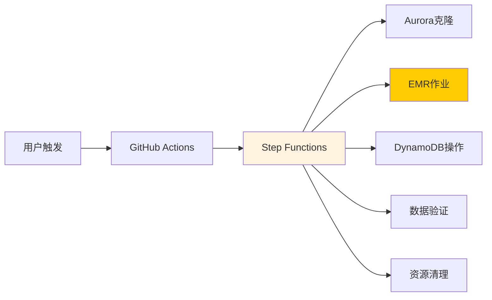
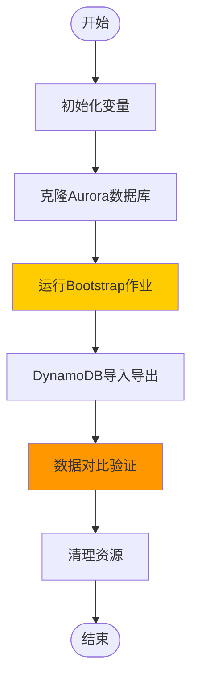
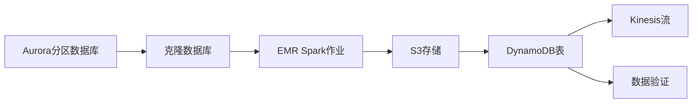

# Workflow Quick Reference

This document provides a concise overview of the system's key workflows for quick reference during development and troubleshooting.

## System Overview



## Step Functions Main Flow



## Data Flow Summary



## Key Parameters

| Parameter | Purpose | Default | Example |
|-----------|---------|---------|---------|
| `env` | Environment | - | `test`, `prod` |
| `processDomain` | Data domain | - | `rates`, `availability` |
| `io` | Official run flag | `false` | `true`, `false` |
| `readParallelism` | Read concurrency | `100` | `50`, `200` |
| `writeParallelism` | Write concurrency | `6` | `3`, `10` |

## Common Commands

### Manual Trigger
```bash
# Via GitHub Actions UI
# Go to Actions → Run Step Function Workflow
# Select parameters and click "Run workflow"
```

### Status Monitoring
```bash
# Step Functions execution ARN will be shown in GitHub Actions logs
# Monitor in AWS Console: Step Functions → State machines → Executions
```

### Troubleshooting
```bash
# Check CloudWatch logs for EMR jobs
# Check S3 for output files and logs
# Check DynamoDB tables for import status
```

---

*For detailed diagrams and comprehensive documentation, see [Architecture Diagrams](architecture-diagrams.md)*