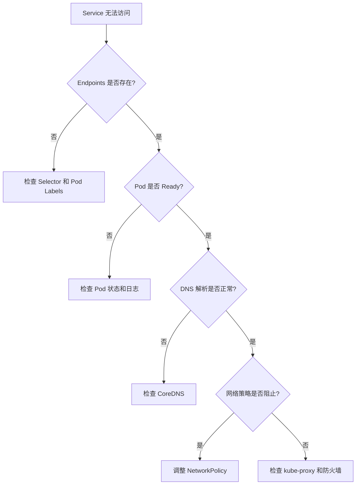

# Kubernetes Service 深度解析

## 目录

1. [Service 概述](#service-概述)
2. [Service 类型详解](#service-类型详解)
   - [ClusterIP](#clusterip)
   - [NodePort](#nodeport)
   - [LoadBalancer](#loadbalancer)
   - [ExternalName](#externalname)
3. [Service 工作原理](#service-工作原理)
4. [Service 发现机制](#service-发现机制)
5. [实战案例](#实战案例)
6. [最佳实践](#最佳实践)
7. [常见问题与解决方案](#常见问题与解决方案)

## Service 概述

### Service 的定义和在 Kubernetes 中的角色

Service 是 Kubernetes 中的一种资源对象，负责将一组提供相同功能的 Pod 组合在一起，并为客户端提供统一的访问接口。它在 Kubernetes 中扮演着至关重要的角色：

1. **服务抽象层**：Service 作为 Pod 的抽象层，隐藏了后端 Pod 的复杂性和动态性
2. **网络代理**：提供稳定的网络入口，代理请求到后端 Pod
3. **服务注册中心**：自动发现和注册符合条件的 Pod
4. **负载均衡器**：在多个 Pod 副本之间分发流量

### Service 与 Pod、Deployment 的关系

```
Deployment（声明式管理）
    |
    v
ReplicaSet（副本控制）
    |
    v
Pod（实际运行容器）
    ^
    |
Service（提供访问入口）
```

- **Pod**：Kubernetes 中最小的部署单元，Service 通过选择器（Selector）将多个 Pod 关联起来
- **Deployment**：管理 Pod 的生命周期，确保指定数量的 Pod 副本运行
- **Service**：与 Deployment 是松耦合关系，通过标签选择器动态关联 Pod

### 为什么需要 Service？

#### Pod 的动态性和 IP 不固定问题

在 Kubernetes 集群中，Pod 具有高度的动态性，这是容器编排系统的核心特征之一：

**Pod IP 的临时性特征：**
- **生命周期短暂**：Pod 可能随时被创建、销毁或重建
- **IP 地址动态分配**：每次 Pod 重建都会获得新的 IP 地址
- **跨节点迁移**：Pod 可能被调度到不同的节点，IP 段可能完全不同
- **无法预测**：无法提前知道 Pod 会获得哪个 IP 地址

**导致 Pod 变化的常见场景：**
- **扩缩容操作**：根据负载自动增加或减少 Pod 数量
- **滚动更新**：部署新版本时逐步替换旧 Pod
- **节点故障**：节点宕机时 Pod 需要在其他节点重建
- **资源调度**：调度器可能因资源优化重新调度 Pod
- **健康检查失败**：不健康的 Pod 会被自动重启或替换
- **节点维护**：节点升级或维护时 Pod 需要迁移

#### 负载均衡的需求

现代应用通常需要多个副本来实现高可用和性能扩展：

**为什么需要负载均衡：**
1. **流量分发**：将请求均匀分发到多个 Pod 副本
2. **避免热点**：防止某个 Pod 过载而其他 Pod 空闲
3. **故障隔离**：某个 Pod 故障时自动将流量转移到健康 Pod
4. **性能优化**：充分利用所有 Pod 的计算资源
5. **会话管理**：支持会话亲和性（Sticky Session）需求

**Service 提供的负载均衡能力：**
- **自动发现后端**：通过标签选择器自动发现所有匹配的 Pod
- **健康检查集成**：只将流量发送到通过健康检查的 Pod
- **多种算法支持**：轮询、最少连接、源地址哈希等
- **实时更新**：Pod 变化时自动更新负载均衡配置

#### 服务发现的重要性

在微服务架构中，服务之间需要相互通信，服务发现是关键需求：

**传统服务发现的痛点：**
- 需要手动维护服务注册表
- 配置文件需要频繁更新
- 难以应对动态变化
- 容易出现配置不一致

**Kubernetes Service 的服务发现优势：**
1. **自动注册**：Pod 创建时自动注册到 Service
2. **自动注销**：Pod 删除时自动从 Service 移除
3. **DNS 集成**：通过 DNS 名称访问服务，无需知道 IP
4. **环境变量注入**：自动注入服务地址到 Pod 环境变量
5. **跨命名空间发现**：支持跨命名空间的服务访问

#### 与传统架构的对比

**传统架构（直接使用 IP 地址）的弊端：**

```
传统架构:
Client → 硬编码 IP (192.168.1.10) → Server

问题:
- Server IP 变化需要修改所有客户端配置
- 无法实现负载均衡
- 单点故障风险高
- 扩展性差
```

**使用负载均衡器的传统架构：**

```
改进的传统架构:
Client → Load Balancer (固定 IP) → Server Pool

仍存在的问题:
- 需要手动配置后端服务器列表
- 服务器变更需要手动更新配置
- 负载均衡器本身可能成为瓶颈
- 额外的运维成本
```

**Kubernetes Service 架构的优势：**

```
Kubernetes 架构:
Client → Service (虚拟 IP + DNS) → 动态 Pod 池

优势:
- 自动服务发现和注册
- 无需手动维护后端列表
- 分布式负载均衡（每个节点都参与）
- 与容器生命周期管理集成
```

#### Service 提供的稳定访问入口优势

**1. 稳定的网络标识**
- **不变的 ClusterIP**：Service 的 IP 在其生命周期内保持不变
- **稳定的 DNS 名称**：`service-name.namespace.svc.cluster.local`
- **可预测的访问方式**：客户端代码无需修改

**2. 解耦服务消费者和提供者**
- 消费者只需知道 Service 名称
- 提供者（Pod）可以自由变化
- 支持灰度发布和蓝绿部署

**3. 简化配置管理**
- 无需在配置文件中硬编码 IP 地址
- 环境之间的配置可以保持一致
- 减少配置错误的可能性

#### 标签选择器与滚动部署

Kubernetes 通过标签选择器机制实现了优雅的滚动部署：

**标签选择器的工作原理：**
```yaml
# Service 通过标签选择器选择 Pod
apiVersion: v1
kind: Service
metadata:
  name: webapp-service
spec:
  selector:
    app: webapp
    version: v2  # 可以通过修改选择器实现版本切换
```

**滚动部署的实现机制：**

1. **版本共存**：
   - 新旧版本 Pod 可以同时存在
   - 通过不同的标签区分版本
   - Service 可以同时或选择性地路由流量

2. **渐进式更新**：
   ```yaml
   # Deployment 滚动更新配置
   spec:
     strategy:
       type: RollingUpdate
       rollingUpdate:
         maxSurge: 1        # 允许超出期望副本数的 Pod 数量
         maxUnavailable: 1  # 允许不可用的 Pod 数量
   ```

3. **灰度发布示例**：
   ```yaml
   # 10% 流量到新版本
   # Service 选择器：app=webapp (同时匹配 v1 和 v2)
   # v1 Deployment: replicas=9, labels: app=webapp,version=v1
   # v2 Deployment: replicas=1, labels: app=webapp,version=v2
   ```

4. **蓝绿部署示例**：
   ```yaml
   # 通过修改 Service 选择器实现瞬间切换
   # 蓝版本运行中：selector: app=webapp,version=blue
   # 绿版本准备好后：kubectl patch service webapp-service -p '{"spec":{"selector":{"version":"green"}}}'
   ```

**滚动部署的优势：**
- **零停机时间**：服务始终可用
- **可回滚**：出现问题可快速回滚到上一版本
- **风险可控**：逐步更新，及时发现问题
- **灵活的发布策略**：支持金丝雀发布、A/B 测试等

通过 Service 和标签选择器的配合，Kubernetes 实现了传统架构中需要复杂配置才能实现的高级部署策略，大大简化了应用的运维管理。

### Service 的核心功能

1. **服务发现**: 通过 DNS 或环境变量让其他应用发现服务
2. **负载均衡**: 在多个 Pod 之间分发流量
3. **稳定的网络标识**: 提供不变的 IP 地址和 DNS 名称
4. **端口映射**: 将服务端口映射到 Pod 端口

## Service 类型详解

### ClusterIP

ClusterIP 是默认的 Service 类型，它会分配一个集群内部的虚拟 IP 地址。这是最基础也是最常用的 Service 类型。

#### 特点
- **仅限集群内部访问**：只能从集群内的 Pod 访问
- **自动分配虚拟 IP**：从 Service CIDR 范围分配（通常是 10.96.0.0/12）
- **稳定的网络端点**：Service IP 在其生命周期内保持不变
- **默认类型**：不指定 type 时自动使用 ClusterIP

#### 完整配置示例

```yaml
apiVersion: v1
kind: Service
metadata:
  name: backend-service
  namespace: default
  labels:
    app: backend
    tier: service
spec:
  type: ClusterIP  # 可省略，默认就是 ClusterIP
  clusterIP: 10.96.100.100  # 可选：指定 IP，通常自动分配
  selector:
    app: backend
    tier: api
  ports:
  - name: http
    port: 80          # Service 端口
    targetPort: 8080  # Pod 端口
    protocol: TCP
  - name: https
    port: 443
    targetPort: 8443
    protocol: TCP
  sessionAffinity: None  # 可选：ClientIP 启用会话亲和性
```

#### 使用场景

**1. 微服务架构中的内部通信**
```yaml
# Backend API Service
apiVersion: v1
kind: Service
metadata:
  name: user-api
spec:
  selector:
    app: user-service
  ports:
  - port: 8080
    targetPort: 8080
---
# Frontend 通过 DNS 访问：http://user-api:8080
```

**2. 数据库服务**
```yaml
apiVersion: v1
kind: Service
metadata:
  name: mysql
spec:
  selector:
    app: mysql
  ports:
  - port: 3306
    targetPort: 3306
  clusterIP: None  # Headless Service for StatefulSet
```

**3. 缓存服务（Redis）**
```yaml
apiVersion: v1
kind: Service
metadata:
  name: redis-master
spec:
  selector:
    app: redis
    role: master
  ports:
  - port: 6379
    targetPort: 6379
```

#### 访问方式

**1. 通过 DNS 名称访问**
```bash
# 同命名空间
curl http://backend-service

# 跨命名空间
curl http://backend-service.default.svc.cluster.local
```

**2. 通过环境变量访问**
```bash
# Kubernetes 自动注入的环境变量
BACKEND_SERVICE_SERVICE_HOST=10.96.100.100
BACKEND_SERVICE_SERVICE_PORT=80
```

**3. 从 Pod 内测试**
```bash
# 创建测试 Pod
kubectl run test-pod --image=busybox -it --rm -- sh

# 在 Pod 内测试
wget -qO- http://backend-service
nslookup backend-service
```

#### 注意事项
- ClusterIP 只能在集群内部访问，外部无法直接访问
- 适合不需要外部暴露的服务
- 是构建内部微服务架构的基础

### NodePort

NodePort 在 ClusterIP 的基础上，在每个节点上开放一个静态端口。

**特点：**
- 端口范围：30000-32767
- 可从集群外部访问
- 每个节点都监听相同端口

**使用场景：**
- 开发测试环境
- 小规模应用的外部访问
- 没有云负载均衡器的环境

### LoadBalancer

LoadBalancer 在 NodePort 的基础上，利用云提供商的负载均衡器将流量转发到服务。

**特点：**
- 需要云提供商支持
- 自动创建外部负载均衡器
- 提供外部 IP 地址

**使用场景：**
- 生产环境的外部服务
- 需要高可用的应用
- 云环境部署

### ExternalName

ExternalName 类型的 Service 通过 CNAME 记录将服务映射到外部 DNS 名称。

**特点：**
- 不分配 ClusterIP
- 不定义任何端口或端点
- 返回 CNAME 记录

**使用场景：**
- 访问外部服务
- 数据库迁移过渡
- 跨集群服务引用

## Service 工作原理

### Service 的工作原理详解

Service 的工作原理涉及多个 Kubernetes 组件的协作：

#### 1. kube-proxy 的角色

kube-proxy 是 Service 实现的核心组件：
- **运行位置**：每个节点上都运行一个 kube-proxy Pod
- **主要职责**：
  - 监听 API Server 中 Service 和 Endpoints 对象的变化
  - 根据 Service 信息创建负载均衡规则
  - 实现从 Service 到 Pod 的流量转发

#### 2. iptables/IPVS 模式

**iptables 模式**（默认）：
- 使用 Linux iptables 规则实现流量转发
- 适合中小规模集群（几千个 Service）
- 随机负载均衡算法
- 规则链：PREROUTING → KUBE-SERVICES → KUBE-SVC-* → KUBE-SEP-*

**IPVS 模式**：
- 使用 Linux IPVS（IP Virtual Server）内核模块
- 性能更好，适合大规模集群（数万个 Service）
- 支持多种负载均衡算法：
  - rr（轮询）
  - lc（最少连接）
  - dh（目标地址哈希）
  - sh（源地址哈希）
  - sed（最短期望延迟）
  - nq（不排队调度）

### 核心组件详解

#### 1. Selector（选择器）

Service 使用标签选择器来确定哪些 Pod 属于该服务：

```yaml
apiVersion: v1
kind: Service
metadata:
  name: my-service
spec:
  selector:
    app: myapp
    tier: backend
    version: v1
```

- **匹配规则**：Pod 必须具有所有指定的标签才能被选中
- **动态更新**：新 Pod 创建或销毁时，Service 会自动更新其后端列表

#### 2. Endpoints（端点）

Endpoints 对象记录了 Service 对应的所有 Pod IP 和端口：

```yaml
apiVersion: v1
kind: Endpoints
metadata:
  name: my-service
subsets:
  - addresses:
    - ip: 10.1.0.1
      targetRef:
        kind: Pod
        name: pod-1
    - ip: 10.1.0.2
      targetRef:
        kind: Pod
        name: pod-2
    ports:
    - port: 80
      protocol: TCP
```

- **自动管理**：由 Endpoints Controller 自动创建和维护
- **实时更新**：Pod 状态变化时自动更新
- **健康检查**：只有通过 readinessProbe 的 Pod 才会被加入

#### 3. ClusterIP（集群 IP）

ClusterIP 是 Service 的虚拟 IP 地址：

- **分配机制**：从 Service CIDR 范围中分配（通常是 10.96.0.0/12）
- **稳定不变**：Service 生命周期内 IP 不变
- **虚拟 IP**：不绑定到任何网络接口，由 iptables/IPVS 规则处理

### Service 架构图（文字描述）

```
外部客户端
    |
    v
[节点 IP:NodePort]  ← 外部访问入口（NodePort/LoadBalancer 类型）
    |
    v
[kube-proxy]       ← 每个节点上的网络代理
    |
    v
[iptables/IPVS 规则] ← 流量转发规则
    |
    v
[Service ClusterIP] ← 虚拟 IP（稳定不变）
    |
    v
[Endpoints]        ← Pod IP 列表（动态更新）
    |
    +----+----+----+
    |    |    |    |
    v    v    v    v
 [Pod1][Pod2][Pod3][Pod4] ← 实际处理请求的 Pod
```

### 流量转发过程详解

1. **客户端发起请求**
   - 集群内部：访问 Service ClusterIP
   - 集群外部：访问 NodePort 或 LoadBalancer

2. **kube-proxy 处理**
   - 捕获到达 Service IP 的流量
   - 根据负载均衡算法选择一个后端 Pod

3. **iptables/IPVS 转发**
   - DNAT：将目标 IP 从 Service IP 改为 Pod IP
   - 直接将数据包转发到选中的 Pod

4. **Pod 响应**
   - Pod 处理请求并返回响应
   - 响应直接返回给客户端（不经过 Service）

### 负载均衡算法

默认使用轮询（Round Robin）算法，也支持：
- **会话亲和性**（Session Affinity）：基于客户端 IP
- **负载分发策略**：在 IPVS 模式下支持多种算法

## Service 发现机制

### 环境变量

Kubernetes 会为每个 Service 自动注入环境变量到 Pod 中：
- `{SERVICE_NAME}_SERVICE_HOST`
- `{SERVICE_NAME}_SERVICE_PORT`

### DNS

Kubernetes 内置 DNS 服务（通常是 CoreDNS），为 Service 提供 DNS 记录：
- A 记录：`<service-name>.<namespace>.svc.cluster.local`
- SRV 记录：用于服务端口发现

### Headless Service

通过设置 `clusterIP: None` 创建 Headless Service：
- 不分配 ClusterIP
- DNS 查询返回所有 Pod IP
- 适用于有状态服务

## 实战案例

### 案例一：基础 Pod 和 Service 创建

本示例使用 fleetman webapp 镜像创建一个简单的 Web 应用。

#### 创建 Pod (webapp-pod.yaml)
```yaml
apiVersion: v1
kind: Pod
metadata:
  name: webapp
  labels:
    app: webapp        # 重要：Service 通过此标签选择 Pod
    type: frontend
spec:
  containers:
  - name: webapp
    image: richardchesterwood/k8s-fleetman-webapp-angular:release0
    ports:
    - containerPort: 80
      name: http
```

#### 创建 Service (webapp-service.yaml)
```yaml
apiVersion: v1
kind: Service
metadata:
  name: webapp-service
spec:
  selector:
    app: webapp          # 选择标签为 app=webapp 的 Pod
  ports:
  - name: http
    port: 80            # Service 端口
    targetPort: 80      # Pod 端口
    nodePort: 30080     # Node 端口（30000-32767）
  type: NodePort        # 类型：NodePort，允许外部访问
```

### 部署和验证

```bash
# 创建资源
kubectl apply -f webapp-pod.yaml
kubectl apply -f webapp-service.yaml

# 查看资源状态
kubectl get pods webapp -o wide
kubectl get service webapp-service
kubectl get endpoints webapp-service
```

### 访问 Service

#### 方式一：通过 NodePort 访问（外部访问）
```bash
# 使用 curl 测试
curl http://localhost:30080

# 使用浏览器访问
open http://localhost:30080
```

#### 方式二：通过 Port Forward 访问
```bash
# 将 Service 的 80 端口转发到本地 8080 端口
kubectl port-forward service/webapp-service 8080:80

# 在另一个终端访问
curl http://localhost:8080
```

#### 方式三：从集群内部访问
```bash
# 创建临时 Pod 进行测试
kubectl run test-pod --image=busybox -it --rm -- wget -qO- http://webapp-service

# 或使用 ClusterIP 直接访问
kubectl run test-pod --image=busybox -it --rm -- wget -qO- http://10.97.100.173
```

### Service 工作原理验证

```bash
# 查看 Service 详细信息
kubectl describe service webapp-service

# 查看 Endpoints 对象
kubectl get endpoints webapp-service -o yaml

# 查看 iptables 规则（在 Node 上执行）
sudo iptables -t nat -L -n | grep webapp-service
```

### 案例二：使用 Service 实现滚动部署和流量切换

这个案例展示了如何仅通过修改 Service 的标签选择器来实现不同版本之间的流量切换，无需重新部署或修改 Pod。

#### 背景说明

在生产环境中，我们经常需要在不同版本之间切换流量，例如：
- **快速回滚**：新版本出现问题时，立即切回旧版本
- **蓝绿部署**：在两个完整的环境之间瞬间切换
- **金丝雀发布**：先将少量流量导向新版本进行测试
- **A/B 测试**：同时运行两个版本，进行功能对比

#### 实现原理

Kubernetes Service 通过标签选择器（Label Selector）来确定将流量路由到哪些 Pod。通过修改 Service 的选择器，我们可以精确控制流量的目标 Pod，而无需对 Pod 本身做任何修改。

```
用户请求
    |
    v
Service (标签选择器: version=0)
    |
    v
Pod version=0  ←  流量在这里
Pod version=0-5   (待命状态)

修改选择器后：

用户请求
    |
    v
Service (标签选择器: version=0-5)
    |
    v
Pod version=0     (待命状态)
Pod version=0-5 ←  流量切换到这里
```

#### 步骤 1：部署多版本 Pod

首先，我们部署两个不同版本的 webapp Pod：

```yaml
# webapp-pod.yaml - 包含两个版本的 Pod
apiVersion: v1
kind: Pod
metadata:
  name: webapp0
  labels:
    app: webapp
    type: frontend
    version: "0"  # 版本 0
spec:
  containers:
  - name: webapp
    image: richardchesterwood/k8s-fleetman-webapp-angular:release0
    ports:
    - containerPort: 80
      name: http

---

apiVersion: v1
kind: Pod
metadata:
  name: webapp0-5
  labels:
    app: webapp
    type: frontend
    version: "0-5"  # 版本 0-5
spec:
  containers:
    - name: webapp
      image: richardchesterwood/k8s-fleetman-webapp-angular:release0-5
      ports:
        - containerPort: 80
          name: http
```

部署 Pod：
```bash
kubectl apply -f webapp-pod.yaml

# 验证两个版本的 Pod 都在运行
kubectl get pods -l app=webapp --show-labels
```

输出示例：
```
NAME        READY   STATUS    RESTARTS   AGE   LABELS
webapp0     1/1     Running   0          1m    app=webapp,type=frontend,version=0
webapp0-5   1/1     Running   0          1m    app=webapp,type=frontend,version=0-5
```

#### 步骤 2：创建 Service 并指向特定版本

创建一个 Service，初始指向版本 0：

```yaml
# webapp-service.yaml
apiVersion: v1
kind: Service
metadata:
  name: webapp-service
spec:
  selector:
    app: webapp
    version: "0"  # 初始指向版本 0
  ports:
  - name: http
    port: 80
    targetPort: 80
    nodePort: 30080
  type: NodePort
```

部署 Service：
```bash
kubectl apply -f webapp-service.yaml

# 查看 Service 端点
kubectl get endpoints webapp-service
```

#### 步骤 3：测试当前版本

```bash
# 访问应用
curl http://localhost:30080
# 或在浏览器中打开 http://localhost:30080

# 查看当前 Service 选择的 Pod
kubectl describe service webapp-service | grep -A 2 "Selector:"
```

#### 步骤 4：切换流量到新版本

现在，我们通过修改 Service 的标签选择器来切换流量：

**方法 1：使用 kubectl edit（交互式编辑）**
```bash
kubectl edit service webapp-service
# 将 version: "0" 修改为 version: "0-5"
```

**方法 2：使用 kubectl patch（命令行修改）**
```bash
# 切换到版本 0-5
kubectl patch service webapp-service -p '{"spec":{"selector":{"version":"0-5"}}}'

# 验证修改
kubectl get service webapp-service -o yaml | grep -A 3 "selector:"
```

**方法 3：使用 kubectl apply（声明式更新）**
```bash
# 修改 webapp-service.yaml 文件中的 version 字段
# 然后重新应用
kubectl apply -f webapp-service.yaml
```

#### 步骤 5：验证流量切换

```bash
# 查看新的端点
kubectl get endpoints webapp-service

# 访问应用，应该看到新版本的界面
curl http://localhost:30080

# 查看 Service 当前选择的 Pod
kubectl describe endpoints webapp-service
```

#### 步骤 6：快速回滚（如需要）

如果新版本出现问题，可以立即切回旧版本：

```bash
# 切换回版本 0
kubectl patch service webapp-service -p '{"spec":{"selector":{"version":"0"}}}'

# 验证回滚
kubectl get endpoints webapp-service
```

#### 高级场景：同时为两个版本提供服务

如果你想让 Service 同时将流量路由到两个版本（例如进行 A/B 测试），只需要修改选择器，只保留共同的标签：

```yaml
# 修改 Service，去掉 version 选择器
apiVersion: v1
kind: Service
metadata:
  name: webapp-service
spec:
  selector:
    app: webapp  # 只选择 app=webapp，两个版本都会被选中
  ports:
  - name: http
    port: 80
    targetPort: 80
    nodePort: 30080
  type: NodePort
```

这样，Service 会将流量负载均衡到两个版本的 Pod：

```bash
# 应用修改
kubectl apply -f webapp-service.yaml

# 查看端点，应该包含两个 Pod
kubectl get endpoints webapp-service

# 多次访问，观察负载均衡效果
for i in {1..10}; do
  curl -s http://localhost:30080 | grep -o "Release [0-9.-]*" | head -1
done
```

#### 实战技巧和注意事项

1. **预部署策略**
   - 在切换前确保新版本 Pod 已经完全就绪
   - 使用 readinessProbe 确保 Pod 健康后才接收流量

2. **监控切换过程**
   ```bash
   # 实时监控端点变化
   kubectl get endpoints webapp-service -w
   
   # 在另一个终端监控 Pod 状态
   kubectl get pods -l app=webapp -w
   ```

3. **零停机时间**
   - Service 的选择器修改是即时生效的
   - 现有连接会继续完成，新连接会路由到新的 Pod

4. **版本标签规范**
   - 使用语义化版本号："1.0.0", "1.1.0", "2.0.0"
   - 使用环境标识："prod", "staging", "canary"
   - 使用发布标识："stable", "latest", "beta"

5. **生产环境建议**
   - 使用 Deployment 而不是直接创建 Pod
   - 配合 HPA（Horizontal Pod Autoscaler）自动扩缩容
   - 使用 GitOps 工具（如 ArgoCD）管理配置变更

#### 故障排查

如果流量切换不生效：

```bash
# 1. 检查 Pod 标签是否正确
kubectl get pods -l app=webapp --show-labels

# 2. 检查 Service 选择器
kubectl get service webapp-service -o yaml | grep -A 5 "selector:"

# 3. 检查端点是否更新
kubectl describe endpoints webapp-service

# 4. 检查 Pod 是否就绪
kubectl get pods -l app=webapp

# 5. 查看 Service 事件
kubectl describe service webapp-service
```

#### 总结

通过 Service 的标签选择器机制，我们可以：
- ✅ 实现零停机时间的版本切换
- ✅ 快速回滚到之前的版本
- ✅ 进行蓝绿部署和金丝雀发布
- ✅ 无需修改或重启 Pod
- ✅ 支持复杂的流量管理策略

这种方法特别适合：
- 紧急回滚场景
- 多版本并行测试
- 渐进式发布策略
- 降低部署风险

## 最佳实践

1. **合理选择 Service 类型**
   - 内部服务使用 ClusterIP
   - 测试环境可以使用 NodePort
   - 生产环境推荐 LoadBalancer 或 Ingress

2. **使用命名规范**
   - Service 名称应该清晰描述其功能
   - 遵循 DNS 命名规范（小写字母、数字、连字符）

3. **配置健康检查**
   - 配合 Pod 的 readinessProbe
   - 确保只有健康的 Pod 接收流量

4. **资源限制**
   - 为后端 Pod 设置合适的资源限制
   - 避免单个 Service 后端 Pod 过多

5. **监控和日志**
   - 监控 Service 的连接数和延迟
   - 记录关键的访问日志

## 常见问题与解决方案

### 1. Service 无法访问

**可能原因：**
- 标签选择器不匹配
- Pod 未就绪
- 网络策略限制

**解决方法：**
```bash
# Check Service endpoints
kubectl get endpoints <service-name>

# Check Pod labels
kubectl get pods --show-labels

# Check Service configuration
kubectl describe service <service-name>
```

### 2. 负载不均衡

**可能原因：**
- 客户端连接复用
- 会话保持配置
- Pod 资源不均

**解决方法：**
- 配置合适的会话亲和性
- 调整连接池设置
- 确保 Pod 资源配置一致

### 3. DNS 解析失败

**可能原因：**
- CoreDNS 故障
- 网络配置问题
- 命名空间错误

**解决方法：**
```bash
# Check DNS service
kubectl get svc -n kube-system | grep dns

# Test DNS resolution
kubectl run -it --rm debug --image=busybox --restart=Never -- nslookup <service-name>
```

### 4. 外部访问问题

**NodePort 无法访问：**
- 检查防火墙规则
- 确认节点安全组配置
- 验证端口范围

**LoadBalancer 未分配外部 IP：**
- 检查云提供商配置
- 查看 Service 事件日志
- 确认配额限制

## 高级主题

### Service 与 Ingress 的配合使用

Ingress 和 Service 是 Kubernetes 中互补的网络资源，它们协同工作以提供完整的流量管理解决方案。

#### Ingress 与 Service 的关系

```
外部流量
    |
    v
[Ingress Controller] ← 七层负载均衡（HTTP/HTTPS）
    |
    +--------+--------+
    |        |        |
    v        v        v
[Service A][Service B][Service C] ← 四层负载均衡（TCP/UDP）
    |        |        |
    v        v        v
[Pods...]  [Pods...] [Pods...]
```

#### 典型配置示例

**1. 创建后端 Service**
```yaml
apiVersion: v1
kind: Service
metadata:
  name: webapp-service
  namespace: production
spec:
  selector:
    app: webapp
  ports:
  - name: http
    port: 80
    targetPort: 8080
  type: ClusterIP  # Ingress 后端通常使用 ClusterIP
---
apiVersion: v1
kind: Service
metadata:
  name: api-service
  namespace: production
spec:
  selector:
    app: api
  ports:
  - name: http
    port: 80
    targetPort: 3000
  type: ClusterIP
```

**2. 配置 Ingress 路由**
```yaml
apiVersion: networking.k8s.io/v1
kind: Ingress
metadata:
  name: app-ingress
  namespace: production
  annotations:
    nginx.ingress.kubernetes.io/rewrite-target: /
    nginx.ingress.kubernetes.io/ssl-redirect: "true"
    cert-manager.io/cluster-issuer: "letsencrypt-prod"
spec:
  ingressClassName: nginx
  tls:
  - hosts:
    - app.example.com
    - api.example.com
    secretName: app-tls
  rules:
  # 基于主机名的路由
  - host: app.example.com
    http:
      paths:
      - path: /
        pathType: Prefix
        backend:
          service:
            name: webapp-service
            port:
              number: 80
  # 基于路径的路由
  - host: api.example.com
    http:
      paths:
      - path: /v1
        pathType: Prefix
        backend:
          service:
            name: api-service
            port:
              number: 80
      - path: /v2
        pathType: Prefix
        backend:
          service:
            name: api-v2-service
            port:
              number: 80
```

#### 高级路由功能

**1. 金丝雀发布（Canary Deployment）**
```yaml
apiVersion: networking.k8s.io/v1
kind: Ingress
metadata:
  name: app-ingress-canary
  annotations:
    nginx.ingress.kubernetes.io/canary: "true"
    nginx.ingress.kubernetes.io/canary-weight: "20"  # 20% 流量到新版本
spec:
  rules:
  - host: app.example.com
    http:
      paths:
      - path: /
        pathType: Prefix
        backend:
          service:
            name: webapp-v2-service
            port:
              number: 80
```

**2. 基于请求头的路由**
```yaml
metadata:
  annotations:
    nginx.ingress.kubernetes.io/canary: "true"
    nginx.ingress.kubernetes.io/canary-by-header: "x-canary"
    nginx.ingress.kubernetes.io/canary-by-header-value: "always"
```

#### 最佳实践

1. **Service 类型选择**
   - Ingress 后端始终使用 ClusterIP Service
   - 避免使用 NodePort 或 LoadBalancer 作为 Ingress 后端

2. **健康检查配置**
   ```yaml
   # Service 端
   spec:
     ports:
     - name: http
       port: 80
       targetPort: 8080
     # 配合 Pod 的 readinessProbe
   
   # Ingress 端
   annotations:
     nginx.ingress.kubernetes.io/backend-protocol: "HTTP"
     nginx.ingress.kubernetes.io/healthcheck-path: "/health"
   ```

3. **SSL/TLS 终止**
   - 在 Ingress 层终止 SSL
   - Service 和 Pod 之间使用 HTTP（集群内部通信）
   - 使用 cert-manager 自动管理证书

### 会话亲和性（Session Affinity）配置

会话亲和性确保来自同一客户端的请求始终路由到同一个 Pod，这对于有状态应用非常重要。

#### Service 级别的会话亲和性

**1. 基于客户端 IP 的会话亲和性**
```yaml
apiVersion: v1
kind: Service
metadata:
  name: stateful-app-service
spec:
  selector:
    app: stateful-app
  ports:
  - port: 80
    targetPort: 8080
  sessionAffinity: ClientIP  # 启用基于客户端 IP 的会话亲和性
  sessionAffinityConfig:
    clientIP:
      timeoutSeconds: 10800  # 会话保持时间（3小时）
```

**2. None（默认）- 无会话亲和性**
```yaml
spec:
  sessionAffinity: None  # 每个请求独立负载均衡
```

#### Ingress 级别的会话亲和性

**1. 基于 Cookie 的会话亲和性（推荐）**
```yaml
apiVersion: networking.k8s.io/v1
kind: Ingress
metadata:
  name: app-ingress
  annotations:
    nginx.ingress.kubernetes.io/affinity: "cookie"
    nginx.ingress.kubernetes.io/affinity-mode: "persistent"
    nginx.ingress.kubernetes.io/session-cookie-name: "route"
    nginx.ingress.kubernetes.io/session-cookie-expires: "86400"
    nginx.ingress.kubernetes.io/session-cookie-max-age: "86400"
    nginx.ingress.kubernetes.io/session-cookie-path: "/"
spec:
  rules:
  - host: app.example.com
    http:
      paths:
      - path: /
        pathType: Prefix
        backend:
          service:
            name: webapp-service
            port:
              number: 80
```

**2. 基于 IP Hash 的会话亲和性**
```yaml
metadata:
  annotations:
    nginx.ingress.kubernetes.io/upstream-hash-by: "$binary_remote_addr"
```

#### 会话亲和性使用场景

1. **购物车应用**
   - 用户的购物车数据存储在服务器会话中
   - 需要确保用户始终访问同一个后端实例

2. **WebSocket 连接**
   - 长连接需要保持在同一个 Pod 上
   - 避免连接断开和重连

3. **文件上传服务**
   - 大文件分片上传需要到同一个服务器
   - 临时文件存储在本地文件系统

#### 注意事项

1. **扩缩容影响**
   - Pod 数量变化会影响会话分配
   - 可能导致部分用户会话丢失

2. **Pod 重启影响**
   - Pod 重启会导致会话数据丢失
   - 建议使用外部存储（Redis）保存会话

3. **负载不均衡风险**
   - 长时间的会话可能导致负载倾斜
   - 需要监控各 Pod 的负载情况

### 多端口 Service 配置

许多应用需要暴露多个端口，例如 HTTP 和 HTTPS、主服务和管理接口等。

#### 基础多端口配置

```yaml
apiVersion: v1
kind: Service
metadata:
  name: multi-port-service
spec:
  selector:
    app: multi-port-app
  ports:
  # HTTP 端口
  - name: http
    port: 80
    targetPort: 8080
    protocol: TCP
  # HTTPS 端口
  - name: https
    port: 443
    targetPort: 8443
    protocol: TCP
  # gRPC 端口
  - name: grpc
    port: 50051
    targetPort: 50051
    protocol: TCP
  # 管理端口
  - name: admin
    port: 9090
    targetPort: 9090
    protocol: TCP
  # UDP 端口（如 DNS）
  - name: dns
    port: 53
    targetPort: 53
    protocol: UDP
  type: LoadBalancer
```

#### 高级多端口场景

**1. 数据库服务（MySQL）**
```yaml
apiVersion: v1
kind: Service
metadata:
  name: mysql-service
spec:
  selector:
    app: mysql
  ports:
  - name: mysql
    port: 3306
    targetPort: 3306
  - name: mysqlx  # MySQL X Protocol
    port: 33060
    targetPort: 33060
  - name: mysql-admin  # MySQL Admin
    port: 33062
    targetPort: 33062
  clusterIP: None  # Headless Service for StatefulSet
```

**2. 微服务应用**
```yaml
apiVersion: v1
kind: Service
metadata:
  name: microservice
  annotations:
    service.beta.kubernetes.io/aws-load-balancer-type: "nlb"  # 使用 NLB 支持多协议
spec:
  selector:
    app: microservice
  ports:
  # REST API
  - name: http
    port: 80
    targetPort: http  # 使用命名端口
  # gRPC API
  - name: grpc
    port: 9000
    targetPort: grpc
  # Metrics endpoint
  - name: metrics
    port: 9090
    targetPort: metrics
  # Health check
  - name: health
    port: 8086
    targetPort: health
  type: LoadBalancer
```

**3. Pod 中的命名端口**
```yaml
apiVersion: v1
kind: Pod
metadata:
  name: multi-port-pod
  labels:
    app: microservice
spec:
  containers:
  - name: app
    image: myapp:latest
    ports:
    - name: http
      containerPort: 8080
    - name: grpc
      containerPort: 9000
    - name: metrics
      containerPort: 9090
    - name: health
      containerPort: 8086
```

#### 端口配置最佳实践

1. **使用描述性端口名称**
   - 避免使用 port1、port2 这样的名称
   - 使用 http、https、grpc、metrics 等有意义的名称

2. **端口号规划**
   - 为不同类型的服务预留端口范围
   - 文档记录端口用途
   - 避免端口冲突

3. **协议分离**
   - TCP 和 UDP 服务分开配置
   - 不同协议可能需要不同的 Service

4. **安全考虑**
   - 管理端口只在内部暴露
   - 使用 NetworkPolicy 限制端口访问
   - 敏感端口使用单独的 Service

### Service 的监控和调试方法

有效的监控和调试对于维护健康的 Service 至关重要。

#### 基础调试命令

**1. 查看 Service 状态**
```bash
# 基本信息
kubectl get service webapp-service

# 详细信息
kubectl describe service webapp-service

# YAML 格式输出
kubectl get service webapp-service -o yaml

# 查看所有 Service
kubectl get services --all-namespaces
```

**2. 检查 Endpoints**
```bash
# 查看 Service 的端点
kubectl get endpoints webapp-service

# 详细端点信息
kubectl describe endpoints webapp-service

# 监控端点变化
kubectl get endpoints webapp-service -w
```

**3. 测试 Service 连通性**
```bash
# 从 Pod 内部测试
kubectl run test-pod --image=busybox -it --rm -- sh
# 在 Pod 内执行
wget -O- http://webapp-service
nslookup webapp-service

# 使用 kubectl exec 测试
kubectl exec -it existing-pod -- curl http://webapp-service

# 端口转发测试
kubectl port-forward service/webapp-service 8080:80
curl http://localhost:8080
```

#### 高级调试技巧

**1. 检查 kube-proxy 规则**
```bash
# 在节点上执行
# iptables 模式
sudo iptables -t nat -L -n | grep webapp-service

# IPVS 模式
sudo ipvsadm -Ln | grep -A 10 webapp-service

# 查看 kube-proxy 日志
kubectl logs -n kube-system -l k8s-app=kube-proxy
```

**2. DNS 调试**
```bash
# 测试 DNS 解析
kubectl run -it --rm debug --image=busybox --restart=Never -- sh
# 在 Pod 内执行
nslookup webapp-service
nslookup webapp-service.default.svc.cluster.local
cat /etc/resolv.conf

# 检查 CoreDNS 日志
kubectl logs -n kube-system -l k8s-app=kube-dns
```

**3. 网络路径追踪**
```yaml
# 创建网络调试 Pod
apiVersion: v1
kind: Pod
metadata:
  name: netshoot
spec:
  containers:
  - name: netshoot
    image: nicolaka/netshoot
    command: ["sleep", "3600"]
```

```bash
# 使用调试工具
kubectl exec -it netshoot -- bash
# 在 Pod 内执行
tcpdump -i any host webapp-service
traceroute webapp-service
ss -tulpn
netstat -an
```

#### 监控指标

**1. Prometheus 监控配置**
```yaml
# ServiceMonitor for Prometheus Operator
apiVersion: monitoring.coreos.com/v1
kind: ServiceMonitor
metadata:
  name: webapp-monitor
spec:
  selector:
    matchLabels:
      app: webapp
  endpoints:
  - port: metrics
    interval: 30s
    path: /metrics
```

**2. 关键指标**
- **请求率**: 每秒请求数
- **错误率**: 4xx/5xx 响应比例
- **延迟**: P50/P95/P99 响应时间
- **连接数**: 活跃连接数
- **端点健康**: 健康端点数量

**3. Grafana Dashboard 示例查询**
```promql
# Service 请求率
rate(http_requests_total{service="webapp-service"}[5m])

# 错误率
rate(http_requests_total{service="webapp-service",status=~"5.."}[5m])

# 平均响应时间
histogram_quantile(0.95, rate(http_request_duration_seconds_bucket{service="webapp-service"}[5m]))

# 活跃端点数
count(up{job="webapp-service"} == 1)
```

#### 常见问题诊断流程



### 生产环境最佳实践建议

#### 1. 高可用性设计

**Service 配置**
```yaml
apiVersion: v1
kind: Service
metadata:
  name: production-app
  labels:
    app: webapp
    env: production
  annotations:
    service.beta.kubernetes.io/aws-load-balancer-connection-draining-enabled: "true"
    service.beta.kubernetes.io/aws-load-balancer-connection-draining-timeout: "60"
spec:
  selector:
    app: webapp
    env: production
  ports:
  - name: http
    port: 80
    targetPort: 8080
  - name: https
    port: 443
    targetPort: 8443
  type: LoadBalancer
  externalTrafficPolicy: Local  # 保留客户端源 IP
  healthCheckNodePort: 30000    # 自定义健康检查端口
```

**配合 PodDisruptionBudget**
```yaml
apiVersion: policy/v1
kind: PodDisruptionBudget
metadata:
  name: webapp-pdb
spec:
  minAvailable: 2  # 至少保持 2 个 Pod 可用
  selector:
    matchLabels:
      app: webapp
```

#### 2. 安全最佳实践

**网络策略配置**
```yaml
apiVersion: networking.k8s.io/v1
kind: NetworkPolicy
metadata:
  name: webapp-netpol
spec:
  podSelector:
    matchLabels:
      app: webapp
  policyTypes:
  - Ingress
  - Egress
  ingress:
  - from:
    - namespaceSelector:
        matchLabels:
          name: frontend
    - podSelector:
        matchLabels:
          app: nginx
    ports:
    - protocol: TCP
      port: 8080
  egress:
  - to:
    - namespaceSelector:
        matchLabels:
          name: backend
    ports:
    - protocol: TCP
      port: 3306
```

**Service Account 和 RBAC**
```yaml
apiVersion: v1
kind: ServiceAccount
metadata:
  name: webapp-sa
  namespace: production
---
apiVersion: rbac.authorization.k8s.io/v1
kind: Role
metadata:
  name: webapp-role
  namespace: production
rules:
- apiGroups: [""]
  resources: ["services", "endpoints"]
  verbs: ["get", "list", "watch"]
```

#### 3. 性能优化

**1. 使用 IPVS 模式**
```bash
# 配置 kube-proxy 使用 IPVS
kubectl edit configmap kube-proxy -n kube-system
# 修改 mode: "ipvs"
# 重启 kube-proxy pods
kubectl rollout restart daemonset kube-proxy -n kube-system
```

**2. 调整超时和保活参数**
```yaml
metadata:
  annotations:
    # AWS ELB 注解
    service.beta.kubernetes.io/aws-load-balancer-connection-idle-timeout: "300"
    # GCP 注解
    cloud.google.com/load-balancer-type: "Internal"
    # Azure 注解  
    service.beta.kubernetes.io/azure-load-balancer-tcp-idle-timeout: "30"
```

**3. 启用本地流量策略**
```yaml
spec:
  externalTrafficPolicy: Local
  # 优点：
  # - 保留源 IP
  # - 减少一跳网络延迟
  # - 避免节点间流量
  # 缺点：
  # - 可能导致负载不均衡
```

#### 4. 成本优化

**1. 合理使用 Service 类型**
- 内部服务使用 ClusterIP
- 避免为每个服务创建 LoadBalancer
- 使用 Ingress 聚合外部访问

**2. 资源复用**
```yaml
# 多个服务共享一个 LoadBalancer
apiVersion: v1
kind: Service
metadata:
  name: multi-app-lb
spec:
  selector:
    tier: frontend  # 选择多个应用的前端
  ports:
  - name: app1
    port: 80
    targetPort: 8080
  - name: app2  
    port: 81
    targetPort: 8081
  type: LoadBalancer
```

#### 5. 监控和告警

**关键告警规则**
```yaml
# Prometheus 告警规则
groups:
- name: service-alerts
  rules:
  - alert: ServiceDown
    expr: up{job="kubernetes-service-endpoints"} == 0
    for: 5m
    annotations:
      summary: "Service {{ $labels.service }} is down"
  
  - alert: ServiceHighErrorRate
    expr: rate(http_requests_total{status=~"5.."}[5m]) > 0.05
    for: 5m
    annotations:
      summary: "High error rate for service {{ $labels.service }}"
  
  - alert: ServiceNoHealthyEndpoints
    expr: kube_endpoint_address_available{service="webapp-service"} == 0
    for: 1m
    annotations:
      summary: "No healthy endpoints for service {{ $labels.service }}"
```

### 常见问题 FAQ

#### Q1: Service 的 ClusterIP 是如何分配的？

**A:** ClusterIP 从集群的 Service CIDR 范围中分配（默认 10.96.0.0/12）。分配过程：
1. API Server 收到创建 Service 的请求
2. 如果未指定 clusterIP，从可用池中分配一个
3. 确保 IP 唯一且不与现有 Service 冲突
4. 将 IP 持久化到 etcd
5. Service 删除后 IP 才会释放

#### Q2: 为什么我的 Service 没有 Endpoints？

**A:** 常见原因和解决方法：
1. **标签不匹配**：检查 Service selector 和 Pod labels
   ```bash
   kubectl get pods --show-labels
   kubectl get service my-service -o yaml | grep -A 5 selector
   ```

2. **Pod 未就绪**：检查 readinessProbe
   ```bash
   kubectl get pods -l app=myapp
   kubectl describe pod my-pod | grep -A 10 "Readiness:"
   ```

3. **命名空间不同**：Service 和 Pod 必须在同一命名空间
   ```bash
   kubectl get pods,services --all-namespaces | grep myapp
   ```

#### Q3: Service 的负载均衡是如何实现的？

**A:** 取决于 kube-proxy 模式：

**iptables 模式（默认）**：
- 使用随机概率实现负载均衡
- 每个端点有相等的被选中概率
- 通过 statistic 模块实现

**IPVS 模式**：
- 支持多种算法（rr、lc、dh、sh 等）
- 内核级别的负载均衡，性能更好
- 支持会话保持

#### Q4: 如何实现跨命名空间的 Service 访问？

**A:** 使用完整的 DNS 名称：
```bash
# 格式：<service-name>.<namespace>.svc.cluster.local
curl http://webapp-service.production.svc.cluster.local

# 或创建 ExternalName Service
apiVersion: v1
kind: Service
metadata:
  name: cross-namespace-service
  namespace: namespace-a
spec:
  type: ExternalName
  externalName: original-service.namespace-b.svc.cluster.local
```

#### Q5: NodePort 范围可以修改吗？

**A:** 可以，通过修改 API Server 启动参数：
```bash
# 编辑 API Server 配置
--service-node-port-range=20000-40000

# 或在 kubeadm 配置中
apiVersion: kubeadm.k8s.io/v1beta3
kind: ClusterConfiguration
apiServer:
  extraArgs:
    service-node-port-range: "20000-40000"
```

#### Q6: Service 能否同时支持 TCP 和 UDP？

**A:** 可以，在同一个 Service 中配置多个端口：
```yaml
spec:
  ports:
  - name: tcp-port
    port: 80
    protocol: TCP
  - name: udp-port
    port: 53
    protocol: UDP
```

#### Q7: 如何保留客户端源 IP？

**A:** 不同 Service 类型的方法：

**LoadBalancer**：
```yaml
spec:
  externalTrafficPolicy: Local
```

**NodePort**：
```yaml
spec:
  externalTrafficPolicy: Local
```

**Ingress**：
```yaml
# Nginx Ingress
metadata:
  annotations:
    nginx.ingress.kubernetes.io/enable-real-ip: "true"
```

#### Q8: Service 的会话亲和性能持续多久？

**A:** 默认 10800 秒（3 小时），可通过以下方式修改：
```yaml
spec:
  sessionAffinity: ClientIP
  sessionAffinityConfig:
    clientIP:
      timeoutSeconds: 7200  # 2 小时
```

#### Q9: 如何实现 Service 的灰度发布？

**A:** 几种方法：

**1. 使用多个 Deployment**：
```yaml
# 90% 流量到 v1，10% 到 v2
# v1: replicas=9
# v2: replicas=1
# Service selector 只包含共同标签
```

**2. 使用 Istio 等服务网格**：
```yaml
spec:
  http:
  - match:
    - headers:
        x-version:
          exact: v2
    route:
    - destination:
        host: webapp
        subset: v2
  - route:
    - destination:
        host: webapp
        subset: v1
      weight: 90
    - destination:
        host: webapp
        subset: v2
      weight: 10
```

#### Q10: Service 删除后会发生什么？

**A:** 删除流程：
1. Service 对象从 etcd 中删除
2. kube-proxy 监听到删除事件
3. 清理 iptables/IPVS 规则
4. DNS 记录被移除
5. ClusterIP 返回可用池
6. Endpoints 对象自动删除
7. 已建立的连接可能会中断

## 总结

Kubernetes Service 是实现微服务架构的关键组件，它提供了服务发现、负载均衡和稳定的网络端点。正确理解和使用不同类型的 Service 对于构建可靠的 Kubernetes 应用至关重要。

通过本文的学习，您应该能够：
- 理解 Service 的核心概念和工作原理
- 根据需求选择合适的 Service 类型
- 配置和管理各种类型的 Service
- 解决常见的 Service 相关问题
- 掌握高级特性如会话亲和性、多端口配置
- 实施生产环境的最佳实践
- 有效监控和调试 Service

## 参考资源

- [Kubernetes 官方文档 - Service](https://kubernetes.io/docs/concepts/services-networking/service/)
- [Kubernetes API 参考 - Service v1](https://kubernetes.io/docs/reference/generated/kubernetes-api/v1.28/#service-v1-core)
- [Kubernetes 网络模型](https://kubernetes.io/docs/concepts/services-networking/)
